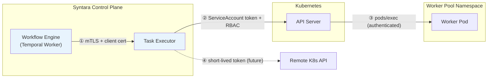
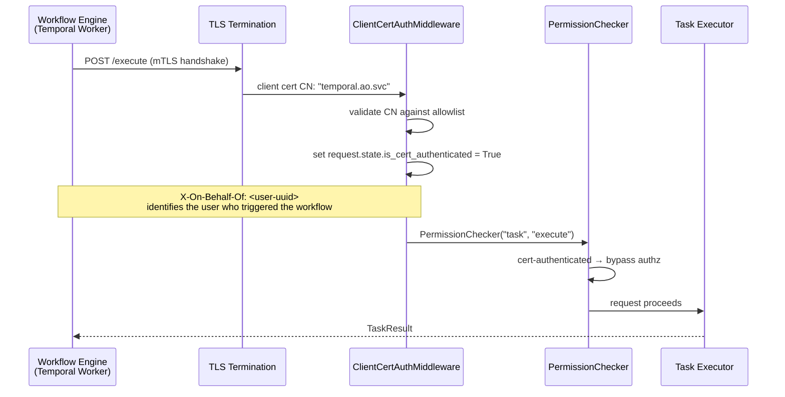
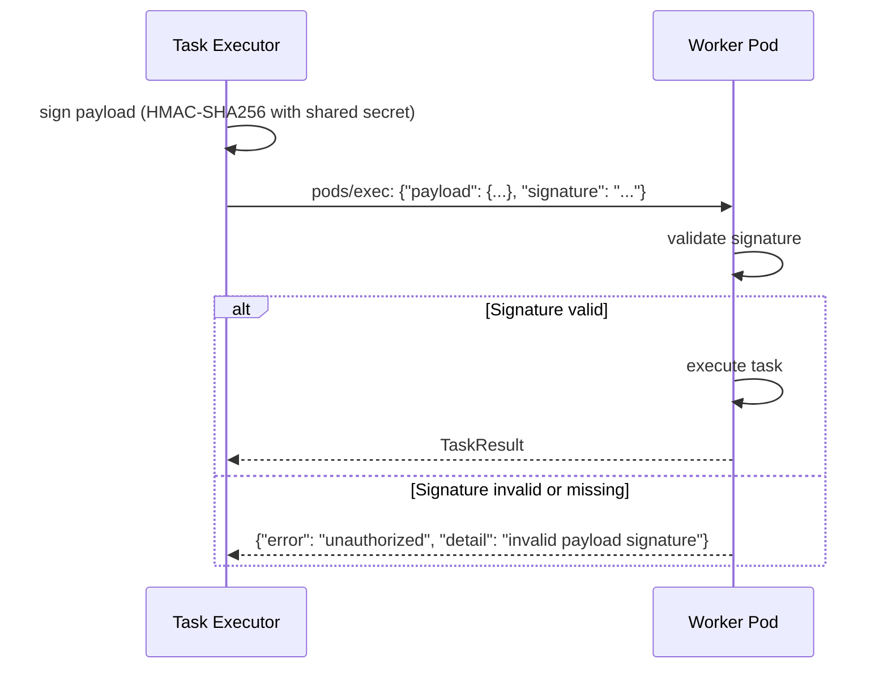

# Execution Plane — Authentication and Zero-Trust

Authentication and zero-trust boundaries for the Execution Plane. Covers how each component authenticates to the next, what industry standards apply, and what is needed for MVP vs future phases.

Companion documents: [execution-plane.md](execution-plane.md) (logical components), [execution-plane-topology.md](execution-plane-topology.md) (deployment model), [execution-plane-invocation.md](execution-plane-invocation.md) (provisioner and dispatcher detail).

## Zero-Trust Principles

The Execution Plane follows zero-trust principles aligned with NIST SP 800-207 and Google BeyondProd:

- **Never trust implicitly.** Every request across a trust boundary is authenticated, regardless of network location.
- **Least privilege.** Each component has the minimum permissions required for its function.
- **Workload identity over network trust.** Authentication is based on the identity of the calling workload, not its network origin. Network policies are defence in depth, not a substitute for authentication.
- **Short-lived credentials.** Tokens and certificates are time-limited and automatically rotated.

## Trust Boundaries

The Execution Plane has four distinct trust boundaries, each with its own authentication mechanism:



## ① Workflow Engine → Task Executor

**Mechanism:** Syntara's existing mTLS + `ClientCertAuthMiddleware`.

The Workflow Engine runs as a Temporal worker within the Syntara control plane. When it calls the Task Executor's `/execute` endpoint, it presents its mTLS client certificate. The `ClientCertAuthMiddleware` validates the certificate CN against the configured allowlist (`s2s_tls_cn_allowlist`). Known service CNs include `temporal.ao.svc` and `worker.ao.svc`.

**How it works:**



**Key properties:**
- **No new authentication mechanism needed.** This is a standard Syntara internal service call.
- **User attribution.** The Workflow Engine passes `X-On-Behalf-Of: <user-uuid>` to identify which user initiated the workflow. This header is trusted only on cert-authenticated requests (stripped for non-cert requests to prevent spoofing).
- **PermissionChecker bypass.** Cert-authenticated requests automatically bypass OPA/Rego authorization. The mTLS identity is sufficient — the Workflow Engine is a trusted internal service.
- **Audit trail.** `PermissionChecker` logs audit events for denied requests. Successful cert-authenticated requests are logged by the middleware.

**Task Executor router pattern:**

```python
_task_execute = PermissionChecker("task", "execute")

@router.post("/execute", dependencies=[Depends(_task_execute)])
async def execute_task(
    task_definition: TaskDefinition,
    current_user: User = Depends(get_current_user),
) -> TaskResult:
    ...
```

This follows the same pattern as every other Syntara router. The `get_current_user` dependency returns a synthetic `User` constructed from the cert CN (via `make_service_user(cert_cn)`) for cert-authenticated requests, or a real user from the JWT for service-account-authenticated requests.

**Alternative: Service Account JWT.** If finer-grained, project-scoped authorization is needed in future (e.g. restricting which projects can dispatch to which pools), the Workflow Engine can authenticate with a Service Account JWT instead. The `PermissionChecker` would then evaluate OPA policy rather than bypassing. This is an additive change — the router code is identical; only the caller's authentication method changes.

## ② Task Executor → Kubernetes API Server

**Mechanism:** Kubernetes bound ServiceAccount token + RBAC.

The Task Executor pod runs with a dedicated Kubernetes ServiceAccount. When it calls the K8s API (to manage pods, Leases, Deployments in Worker Pool namespaces), it presents a bound ServiceAccount token that is automatically projected into the pod and rotated by the kubelet.

**Key properties:**
- **Bound tokens.** Since Kubernetes 1.20+, projected ServiceAccount tokens are audience-scoped and time-limited (default 1 hour, auto-rotated). They are not the legacy non-expiring tokens.
- **RBAC enforcement.** The K8s API server validates the token and enforces RBAC. The Task Executor's ServiceAccount has a Role scoped to the Worker Pool namespace(s) with the minimum required permissions:

| Resource | Verbs | Purpose |
|---|---|---|
| `pods` | get, list, watch | Discover available workers, check readiness |
| `pods/exec` | create | Dispatch tasks to workers |
| `leases` | get, list, watch, create, update | Claim and release workers |
| `deployments` | get, patch | Scale-up (back-pressure) |
| `deployments/scale` | get, update | Scale subresource |

- **Namespace-scoped.** The Role grants permissions only in the Worker Pool namespace(s), not cluster-wide. The Task Executor cannot interact with pods in other namespaces.
- **Audit logging.** The K8s API server audit policy captures all `pods/exec` calls, including the caller identity, target pod, and command. This provides a complete audit trail for task dispatch.

## ③ Kubernetes API Server → Worker Pod (pods/exec)

**Mechanism:** Kubernetes RBAC (caller-side) + kubelet authentication.

When the Task Executor calls `pods/exec`, the request flows through the K8s API server to the kubelet running on the worker's node. The API server authenticates and authorizes the caller (boundary ②). The kubelet authenticates to the API server via its own client certificate.

**Key constraint:** The worker pod itself has no mechanism to authenticate or reject an exec session. From the worker's perspective, the exec'd command is indistinguishable from any other process. This is a Kubernetes architectural limitation.

**Mitigation — signed task payloads (defence in depth):**

To protect against a compromised exec channel (e.g. a stolen ServiceAccount token with `pods/exec` permission), the Task Executor can sign the JSON task payload before dispatching it. The worker validates the signature before executing the task, rejecting unsigned or tampered payloads.



| Aspect | MVP | Future |
|---|---|---|
| Signing algorithm | HMAC-SHA256 with a shared secret (injected as a Kubernetes Secret, mounted into both the Task Executor and Worker pods) | Asymmetric signatures (Ed25519) — the Task Executor holds the private key, workers hold only the public key, eliminating shared-secret risk |
| Secret rotation | Manual rotation via Kubernetes Secret update + rolling restart | Automated rotation with dual-key overlap period |

This is defence in depth — the primary authentication is RBAC at boundary ②. Payload signing adds a second layer that protects against RBAC misconfiguration or token compromise.

## ④ Task Executor → Remote Cluster (Future)

**Mechanism:** Short-lived, audience-scoped tokens for the remote K8s API server.

For ANSTRAT-2337 (remote OpenShift cluster execution), the Task Executor will need to authenticate to K8s API servers on remote clusters. This is out of scope for MVP (single on-cluster pool) but the architecture should not preclude it.

**Recommended approach:**

| Phase | Mechanism | Description |
|---|---|---|
| Initial | Short-lived kubeconfig tokens | The remote cluster issues a scoped ServiceAccount token (audience-bound, time-limited) stored in the Pool Registry. The Task Executor uses this token to authenticate to the remote API server. Token rotation is automated. |
| Mature | SPIFFE/SPIRE federation | SPIRE agents on both clusters federate trust. The Task Executor receives an X.509-SVID that the remote cluster's API server accepts via OIDC federation. No shared secrets or stored tokens. |
| Service mesh | Istio multi-cluster mTLS | Shared root CA across clusters. Transparent mTLS with SPIFFE-based workload identity. AuthorizationPolicy controls which workloads on the control plane cluster can access worker namespaces on the remote cluster. |

## Network Policies (Defence in Depth)

Network policies are not authentication, but they limit the blast radius of a compromised workload. They should be deployed as part of the Cluster Bootstrapper's bootstrap actions.

**Worker Pool namespace policy:**

```yaml
# Deny all ingress by default
apiVersion: networking.k8s.io/v1
kind: NetworkPolicy
metadata:
  name: deny-all-ingress
  namespace: worker-pool
spec:
  podSelector: {}
  policyTypes:
    - Ingress

---
# Allow only pods/exec from the K8s API server
# (pods/exec traffic arrives from the API server, not directly from the Task Executor)
apiVersion: networking.k8s.io/v1
kind: NetworkPolicy
metadata:
  name: allow-apiserver-exec
  namespace: worker-pool
spec:
  podSelector:
    matchLabels:
      app: worker
  policyTypes:
    - Ingress
  ingress:
    - from:
        - ipBlock:
            cidr: <api-server-cidr>
      ports:
        - protocol: TCP
```

**Key point:** Worker pods do not need to accept direct network connections from the Task Executor. All dispatch goes through `pods/exec` via the K8s API server. The NetworkPolicy should deny all direct ingress to worker pods.

Worker pods may need **egress** access to external endpoints (the infrastructure the task interacts with). Egress policies should be scoped per pool based on the pool's connectivity metadata.

## Summary

| Boundary | Mechanism | Authentication | Authorization | MVP |
|---|---|---|---|---|
| ① WE → Task Executor | mTLS client cert | `ClientCertAuthMiddleware` validates cert CN | `PermissionChecker` (bypassed for cert-authed) | Yes |
| ② TE → K8s API | Bound SA token | K8s API server validates token | RBAC (namespace-scoped Role) | Yes |
| ③ K8s API → Worker | Kubelet auth | API server → kubelet (transparent) | RBAC (boundary ②) | Yes |
| ③ Payload integrity | Signed payload | HMAC-SHA256 shared secret | Worker validates signature | Yes |
| ④ TE → Remote cluster | Short-lived token | Remote API server validates token | Remote RBAC | No (ANSTRAT-2337) |
| Network | NetworkPolicy | N/A (not authentication) | Deny-by-default ingress to workers | Yes |
| Audit | K8s audit + Syntara audit | N/A | N/A | Yes |

## Standards Alignment

| Standard | How the Execution Plane aligns |
|---|---|
| NIST SP 800-207 (Zero Trust Architecture) | Every trust boundary has explicit authentication. No implicit trust based on network location. Least-privilege RBAC. |
| Google BeyondProd | Workload identity via mTLS certificates and Kubernetes ServiceAccount tokens. Authentication based on workload identity, not network origin. |
| NIST SP 800-204B (Zero Trust for Microservices) | mTLS between control plane services. Signed payloads for integrity. Network policies as defence in depth. |
| CNCF Zero Trust | Short-lived, automatically rotated credentials (bound SA tokens). Policy-as-code authorization (OPA/Rego via PermissionChecker). |
