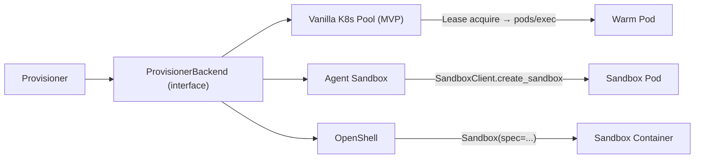
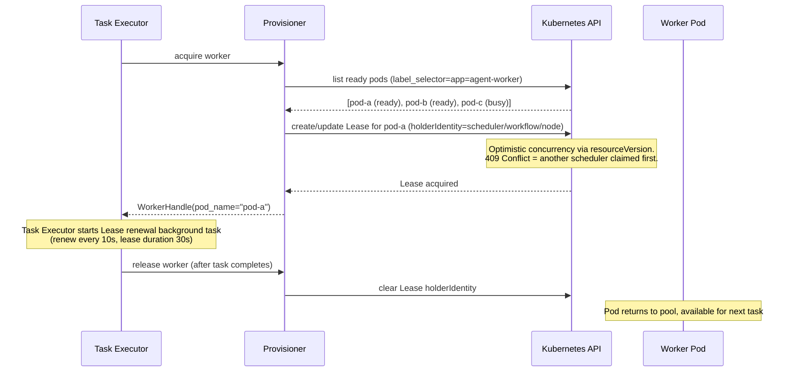
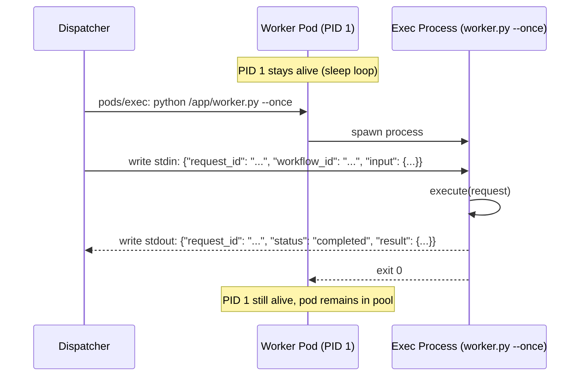
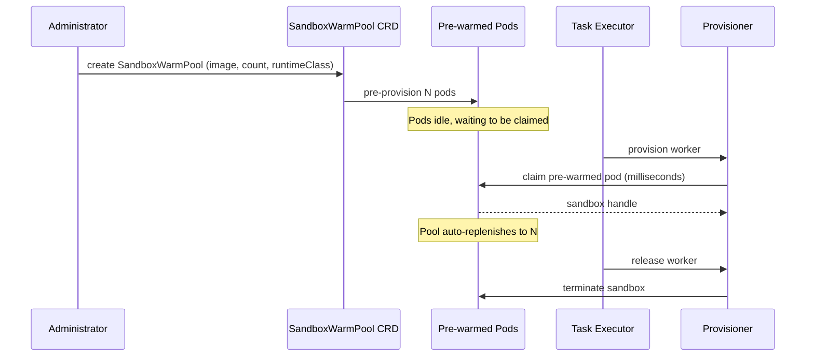
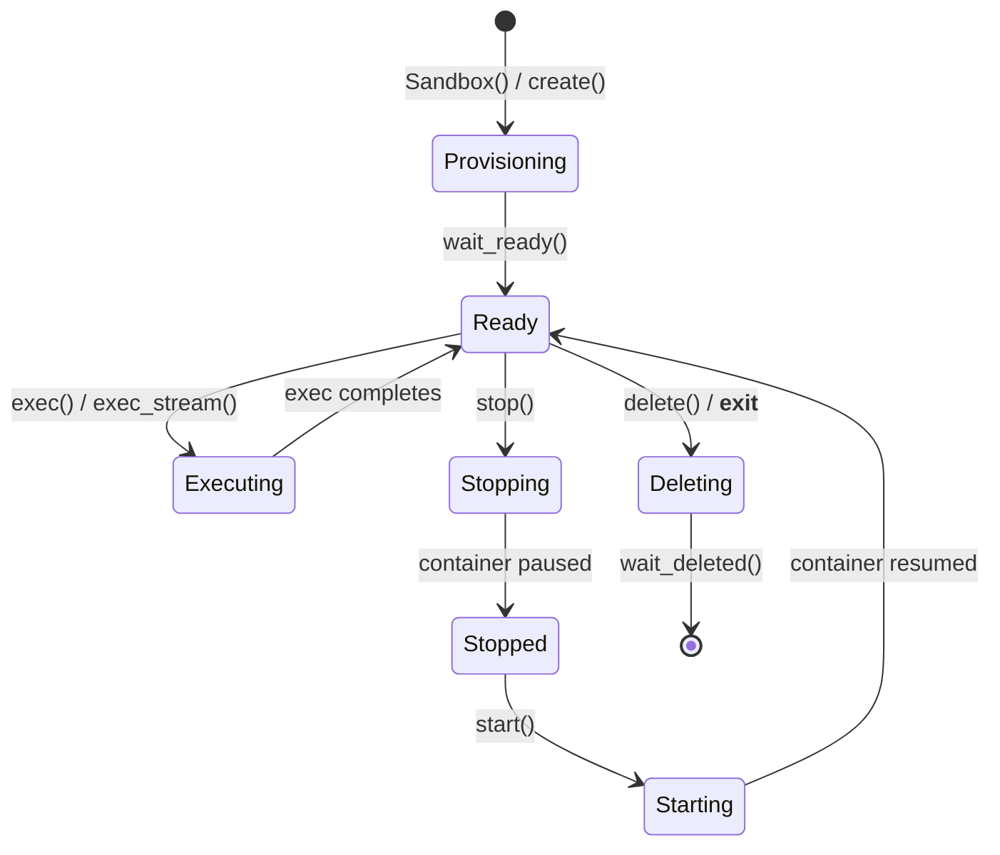
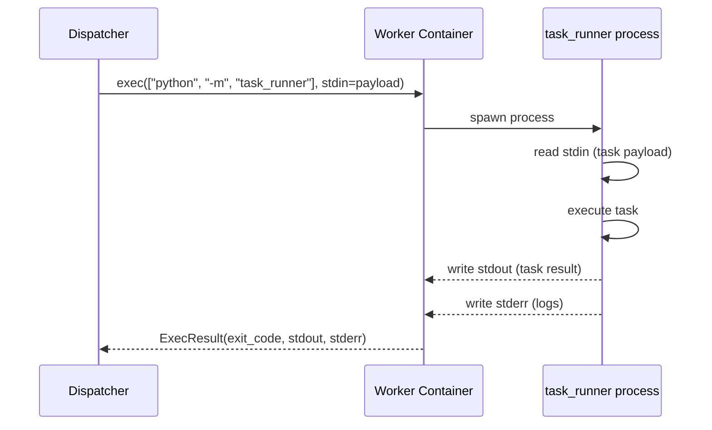
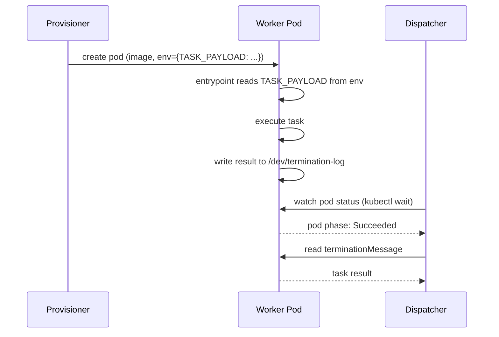
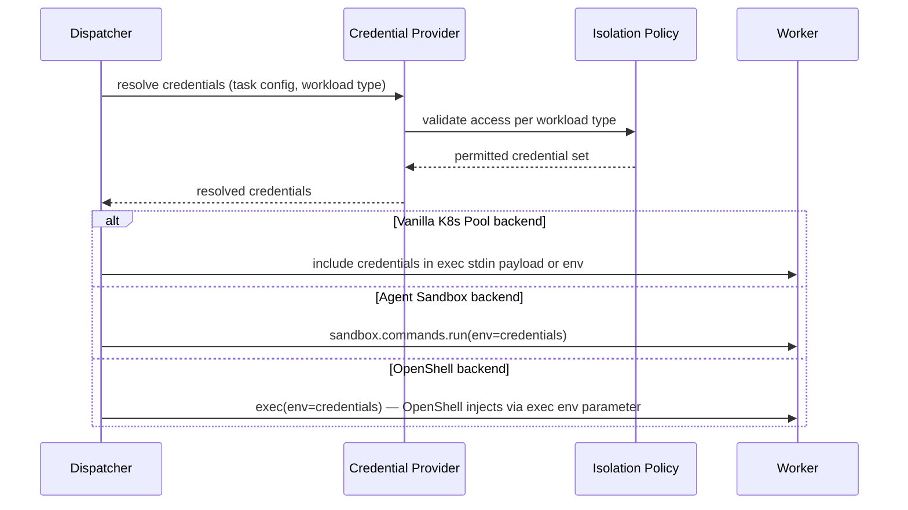
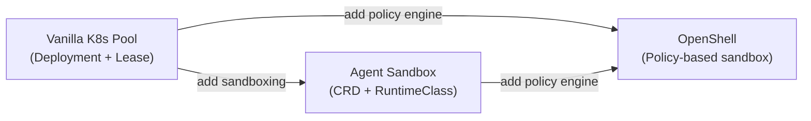

# Execution Plane — Provisioner and Dispatcher Invocation

Detail of how the Provisioner acquires Workers and how the Dispatcher invokes tasks within them. Companion to [execution-plane.md](execution-plane.md).

## Provisioner Models: Shared Pool vs Per-Task Pod

The Execution Plane supports two fundamental provisioning models:

| Model | How it works | Startup latency | Worker lifetime |
|---|---|---|---|
| **Shared pool** (claim/release) | A Deployment maintains N warm pods. The Provisioner claims one via a distributed lock and releases it after the task completes. The pod stays alive for the next task. | Milliseconds (pod already running) | Long-lived, reusable |
| **Per-task pod** (create/destroy) | The Provisioner creates a new pod for each task and destroys it afterward. | Seconds (image pull + container start) | Ephemeral, single-use |

The MVP uses the **shared pool** model via a vanilla Kubernetes Deployment with Lease-based claiming. Future backends (Agent Sandbox, OpenShell) may use either model depending on their capabilities.

### ProvisionerBackend Interface

The interface abstracts over both models. `acquire` claims or creates a worker; `release` returns it to the pool or destroys it.

```python
class WorkerHandle:
    id: str
    pod_name: str
    namespace: str
    backend: str  # "vanilla-k8s" | "agent-sandbox" | "openshell"

class ProvisionerBackend(Protocol):
    async def acquire(self, image: str, resources: ResourceRequirements,
                      security_context: SecurityContext, labels: dict[str, str],
                      env: dict[str, str], timeout: float) -> WorkerHandle: ...
    async def release(self, handle: WorkerHandle) -> None: ...
```

For shared-pool backends, `acquire` claims a pre-existing pod (fast); for per-task backends, `acquire` creates a new pod and waits for it to be ready (slow). The caller doesn't know which model is in use.

### Backend Implementations



#### Backend 1: Vanilla Kubernetes Pool (MVP)

The MVP backend. A Kubernetes Deployment maintains a pool of identical long-running worker pods. The Provisioner claims a worker via a Kubernetes Lease (distributed lock) and releases it after the task completes. No external dependencies beyond the Kubernetes API.

Reference implementation: `k8s-agent-pool` prototype.

**Architecture:**

```
Workflow A (Task Executor) ─┐
                            │
Workflow B (Task Executor) ─┼──▶ Kubernetes Leases ──▶ Worker Pods (Deployment)
                            │           │
Workflow C (Task Executor) ─┘      pods/exec
                                  stdin/stdout
```

**Infrastructure (deployed once by administrator):**

The pool is a standard Kubernetes Deployment with RBAC for the scheduler service account:

- `Namespace` — dedicated namespace for worker pods (e.g. `agent-system`)
- `Deployment` — maintains N replica worker pods with readiness/liveness probes
- `ServiceAccount` + `Role` + `RoleBinding` — grants the scheduler `pods` (get/list/watch), `pods/exec` (create), and `leases` (get/list/watch/create/update)

**Worker pod:** A long-running container whose PID 1 process stays alive. Each task is executed via `pods/exec` which spawns a separate process (`worker.py --once`) that reads a JSON request from stdin and writes a JSON response to stdout. The pod remains in the pool after the exec session completes.

**Claim lifecycle (Lease-based distributed locking):**



**Key mechanisms:**

| Mechanism | Detail |
|---|---|
| **Lease as distributed lock** | Each worker pod has a Lease named `worker-{pod_uid[:20]}`. The Lease's `holderIdentity` indicates the current owner. Leases use `resourceVersion` for optimistic concurrency — a 409 Conflict means another scheduler claimed first. |
| **Lease renewal** | While a task executes, a background coroutine renews the Lease every 10 seconds (lease duration is 30 seconds). If renewal fails (409 Conflict or ownership changed), the task is considered suspect. |
| **Lease expiry** | If a scheduler crashes, its Leases expire after 30 seconds. Other schedulers can then claim the abandoned workers. |
| **Pod replacement** | If a worker pod dies, the Deployment/ReplicaSet automatically creates a replacement. The dead pod's Lease expires naturally. |
| **Multi-scheduler** | Multiple Task Executor instances can share the same pool. The Lease prevents double-claiming. Candidates are shuffled randomly to avoid all schedulers hammering the same pod. |
| **Pod readiness** | Only pods in `Running` phase with `Ready` condition are candidates for claiming. |

**Worker process protocol:**



**Strengths:**
- No external dependencies — pure Kubernetes API (CoreV1, CoordinationV1)
- Warm pool — pods are pre-provisioned, task startup is milliseconds (no image pull)
- Multi-scheduler safe — Leases provide distributed concurrency control
- Self-healing — Deployment replaces crashed pods automatically
- Full OpenShift support — no experimental caveats, no privileged SCC required
- Simple RBAC — scheduler only needs pods (read), pods/exec (create), leases (CRUD)

**Weaknesses:**
- No sandboxing beyond namespace/network policy isolation (pods are not reset between tasks)
- No built-in credential isolation per workload type — caller-managed
- Polling-based worker discovery (no queue/backpressure)
- No resource-aware scheduling (all pods in the pool are identical)

**Production hardening (future):**
- Queue/backpressure instead of polling for available workers
- Worker reset mechanism between tasks (clean environment)
- Robust exec stream reconnect/error handling
- Metrics and tracing (claim latency, utilization, lease contention)
- Fairness across workflows
- Separate pools by capability (action vs. agentic, GPU vs. CPU)
- Pod readiness/liveness probes specific to the agent runtime

#### Backend 2: Agent Sandbox (K8s-native, warm pools)

Uses the `kubernetes-sigs/agent-sandbox` project (`k8s-agent-sandbox` PyPI package). Provides a `SandboxWarmPool` CRD for pre-provisioned pods that are claimed in milliseconds rather than waiting for image pull + container start.

```python
from k8s_agent_sandbox import SandboxClient

client = SandboxClient()
sandbox = client.create_sandbox(
    warmpool="action-warmpool",
    namespace="workers",
    env={"TASK_ID": task_id},
    labels={"workload-type": "action"},
    sandbox_ready_timeout=180,
)
```

**Strengths:** Warm pools dramatically reduce task startup latency. Isolation delegated to `RuntimeClass` (gVisor, Kata Containers). K8s-native CRDs — fits OpenShift's operator model. Async variant (`AsyncSandboxClient`) available.

**Weaknesses:** Warm pools only work when no per-sandbox `env` is set (custom env forces a cold start). No built-in credential injection. Requires the Agent Sandbox operator to be deployed.

**Warm pool lifecycle:**



#### Backend 3: OpenShell (richest sandbox features)

NVIDIA's OpenShell provides policy-based sandboxing, built-in credential providers, and a full lifecycle API. Most feature-rich but OpenShift support is currently experimental.

```python
from openshell import Sandbox

with Sandbox(
    workspace="default",
    spec={
        "template": {"image": "registry.example.com/ee-action:latest"},
        "environment": {"TASK_ID": task_id},
        "resource_requirements": {"cpu": "500m", "memory": "512Mi"},
        "policy": sandbox_policy,      # filesystem, network, process restrictions
        "providers": ["vault-creds"],  # credential providers resolved by OpenShell
    },
    delete_on_exit=True,
    ready_timeout_seconds=120.0,
) as sb:
    result = sb.exec(["python", "-m", "task_runner"])
```

**Strengths:** Policy-based sandboxing (filesystem, network, process restrictions). Built-in credential providers (Kubernetes Secrets, HashiCorp Vault). Full lifecycle management via context manager. `exec_python()` can ship serialized callables directly.

**Weaknesses:** OpenShift support is experimental — requires privileged SCC for the sandbox service account and Helm overrides to clear hardcoded UID/fsGroup. The sandbox supervisor needs elevated privileges for nftables-based network policy enforcement. Additional infrastructure (OpenShell gateway, compute driver) required.

**OpenShell sandbox lifecycle:**



### Backend Comparison

| Dimension | Vanilla K8s Pool (MVP) | Agent Sandbox | OpenShell |
|---|---|---|---|
| Provisioning model | Shared pool (claim/release via Lease) | Warm pool (claim from CRD-managed pool) | Per-task (create/destroy sandbox) |
| Startup latency | Milliseconds (warm pod) | Milliseconds (warm pool) | Seconds (cold start) |
| Sandboxing | Namespace + NetworkPolicy | RuntimeClass (gVisor/Kata) | Policy-based (fs/net/proc) |
| Credential injection | Caller-managed | Caller-managed | Built-in providers |
| OpenShift support | Full | Full | Experimental |
| Extra infrastructure | None (Deployment + Lease) | Operator + CRD | Gateway + compute driver |
| Multi-scheduler | Yes (Lease concurrency) | SDK-managed | N/A (per-task) |
| Worker reuse | Yes (pod stays alive) | Configurable | No (sandbox destroyed) |
| Lifecycle management | Deployment/ReplicaSet | SDK-managed | Context manager |

## Dispatcher: Invoking the Worker

Once the Provisioner has a running Worker, the Dispatcher delivers the task payload and collects results. Two invocation patterns are available.

### Pattern A: Exec-based (stdin/stdout streaming)

The Dispatcher execs into the running container and streams the task payload via stdin. The Worker container runs a `task_runner` entrypoint that reads stdin, executes the task, and writes the result to stdout.



**Implementation per backend:**

```python
# Vanilla K8s Pool (MVP) — via WorkerPool.execute()
# Internally uses kubernetes.stream for pods/exec with JSON-lines protocol.
# The allocator handles the exec lifecycle: open stream, write stdin, read stdout, close.
result = await pool.execute(worker, request=task_payload, owner=owner)

# The underlying exec call (what WorkerPool.execute does):
from kubernetes.stream import stream

resp = stream(
    v1.connect_get_namespaced_pod_exec,
    name=worker_handle.pod_name,
    namespace="workers",
    command=["python", "/app/worker.py", "--once"],
    container="worker",
    stdin=True, stdout=True, stderr=True, tty=False,
    _preload_content=False,  # returns WSClient for streaming I/O
)
resp.write_stdin(json.dumps(task_payload) + "\n")
# Read stdout until newline-terminated JSON response
while resp.is_open():
    resp.update(timeout=1)
    if resp.peek_stdout():
        stdout += resp.read_stdout()
    if stdout.endswith("\n"):
        break
result = json.loads(stdout.strip())
resp.close()

# Agent Sandbox
result = sandbox.commands.run(
    "python -m task_runner",
    stdin=json.dumps(task_payload),
)

# OpenShell
result = sandbox.exec(
    command=["python", "-m", "task_runner"],
    stdin=json.dumps(task_payload).encode(),
    env=credentials,
    timeout_seconds=300,
)

# OpenShell (streaming — for long-running tasks with heartbeats)
for chunk in sandbox.exec_stream(
    command=["python", "-m", "task_runner"],
    stdin=json.dumps(task_payload).encode(),
    env=credentials,
):
    if isinstance(chunk, ExecChunk):
        handle_heartbeat_or_log(chunk.stream, chunk.data)
    else:
        final_result = chunk  # ExecResult
```

**Strengths:** Decouples task delivery from provisioning. Works with all three backends. Supports streaming heartbeats and incremental output. The Worker container doesn't need a network listener — no exposed ports, no service mesh.

**Weaknesses:** Large payloads over stdin can be awkward. Binary data requires encoding. The exec WebSocket connection must stay open for the task duration.

### Pattern B: Entrypoint-based (task baked into pod spec)

The task payload is injected at provisioning time — as environment variables, a mounted ConfigMap, or a volume-mounted file. The container's entrypoint runs the task immediately on startup. The Dispatcher watches pod status and collects the result from the pod's termination message or a shared volume.



**Strengths:** No exec call needed — simpler. Pod completion is the signal. Works naturally with Kubernetes Job semantics. No long-lived WebSocket connection.

**Weaknesses:** Task payload must be known at provisioning time (no dynamic dispatch to a warm pod). No streaming output during execution. Result size limited by termination message (4KB) or requires a shared volume. Incompatible with warm pools (pod entrypoint runs once).

### Invocation Pattern Comparison

| Dimension | Exec-based (Pattern A) | Entrypoint-based (Pattern B) |
|---|---|---|
| Warm pool compatible | Yes | No (entrypoint runs once) |
| Streaming output | Yes (stdout/stderr) | No (batch at completion) |
| Payload delivery | stdin at exec time | env/ConfigMap at create time |
| Result collection | stdout from exec | terminationMessage or volume |
| Connection lifetime | Open for task duration | Watch only |
| Dynamic dispatch | Yes (exec into idle pod) | No (one task per pod) |

### Recommendation

**Exec-based (Pattern A)** is the stronger fit for the Execution Plane:
- Compatible with warm pools (Agent Sandbox) — claim an idle pod, then exec into it
- Supports streaming heartbeats and incremental output, which the Dispatcher needs for timeout management
- Works identically across all three backends
- Decouples provisioning from dispatch — the Task Executor can provision a Worker, then dispatch multiple tasks to it sequentially if the architecture evolves

## Credential Injection at Dispatch Time

Regardless of the Provisioner backend, credentials must reach the Worker securely. The Dispatcher handles this via the Credential Provider, using one of three injection mechanisms depending on the backend:



| Backend | Injection mechanism | Disk-free | Audit trail |
|---|---|---|---|
| Vanilla K8s Pool (MVP) | Credentials included in the JSON request payload via stdin, or written to `emptyDir` with `medium: Memory` (tmpfs) | Yes | Custom (control plane logs) |
| Agent Sandbox | `sandbox.commands.run()` with env | Yes | Custom (control plane logs) |
| OpenShell | `exec(env={...})` — per-exec env injection | Yes | OpenShell audit log |
| OpenShell (providers) | `SandboxSpec.providers` — resolved by gateway | Yes | Provider-specific (Vault, K8s) |

All mechanisms ensure credentials are never persisted to disk and are wiped when the Worker terminates.

## MVP Recommendation

| Concern | Recommendation | Rationale |
|---|---|---|
| MVP Provisioner backend | **Vanilla Kubernetes Pool** | Warm pods via Deployment, Lease-based claiming, pure K8s API, full OpenShift support, no external dependencies. Short-term stepping stone. |
| Next Provisioner backend | Agent Sandbox | Adds RuntimeClass sandboxing (gVisor/Kata), CRD-managed warm pools, and an async SDK |
| Future Provisioner backend | OpenShell | Adds policy-based sandboxing and built-in credential providers when OpenShift support matures |
| Dispatcher invocation | Exec-based (Pattern A) | Works with all backends, supports streaming, compatible with warm/shared pools |
| Credential injection | Credentials in stdin payload + memory-backed volume fallback | Leverages Syntara's existing credential store; no external secret manager dependency |
| Interface design | `acquire`/`release` `ProvisionerBackend` protocol | Abstracts over both shared-pool (claim/release) and per-task (create/destroy) models. Swapping backends is a configuration change, not a code change. |

### Migration Path

The vanilla Kubernetes pool is a deliberate stepping stone. It provides the warm-pool and exec-based dispatch patterns that the Execution Plane needs, using only standard Kubernetes primitives. When stronger sandboxing or LLM-centric runtime features are required, the `ProvisionerBackend` interface allows swapping to Agent Sandbox or OpenShell without changing the Task Executor, Reconciler, Dispatcher, or any other Execution Plane component.



| Phase | Backend | What it adds |
|---|---|---|
| **MVP** | Vanilla K8s Pool | Warm pods, Lease claiming, exec dispatch, multi-scheduler |
| **Phase 2** | Agent Sandbox | gVisor/Kata isolation, CRD-managed pools, async SDK |
| **Phase 3** | OpenShell | Policy-based fs/net/proc sandboxing, built-in credential providers, `exec_python()` |
