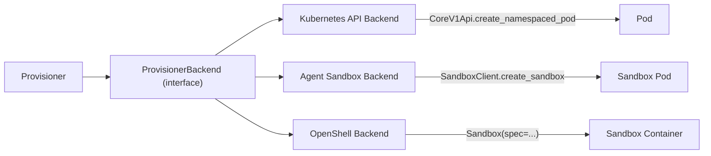
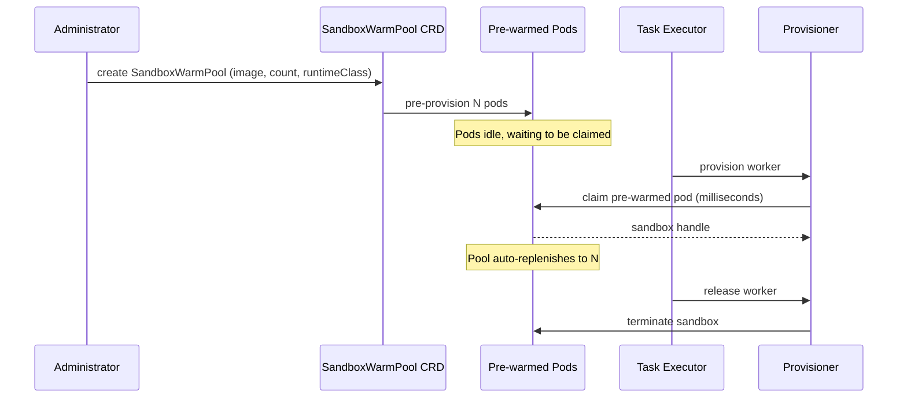
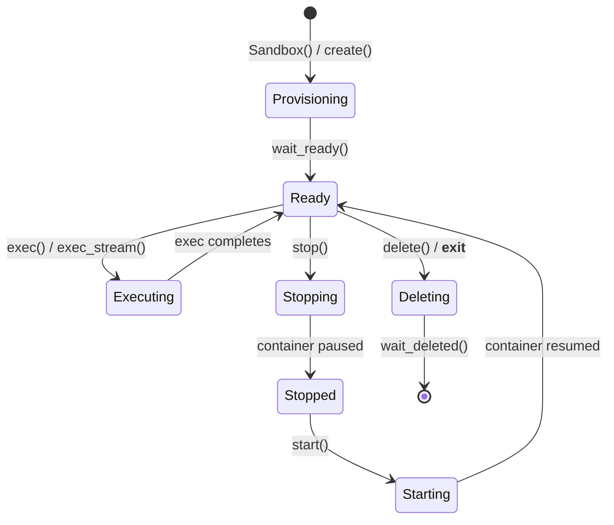
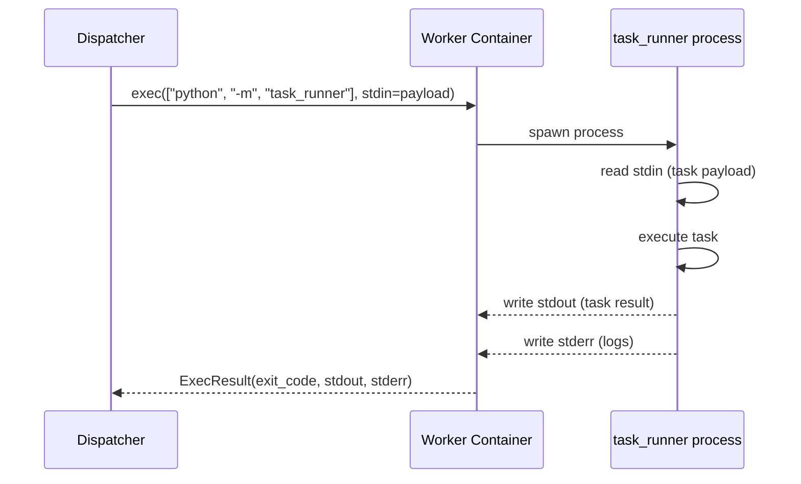
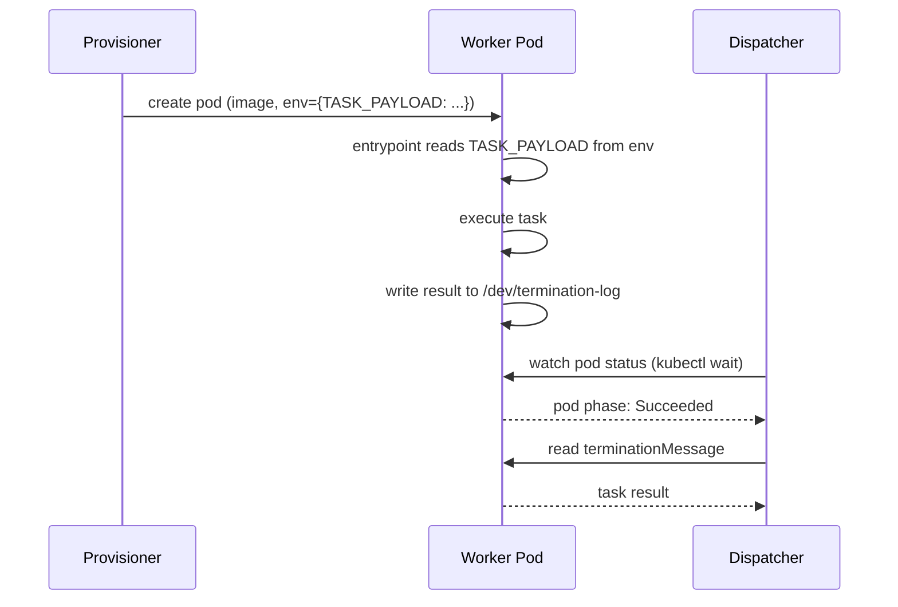
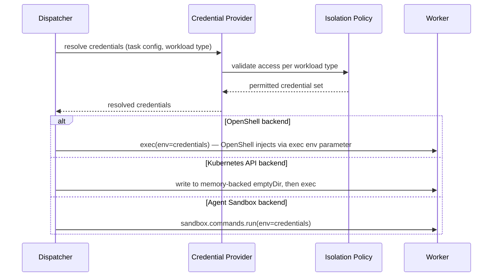

# Execution Plane — Provisioner and Dispatcher Invocation

Detail of how the Provisioner creates Workers and how the Dispatcher invokes tasks within them. Companion to [execution-plane.md](execution-plane.md).

## Provisioner: Creating a Worker

The Provisioner creates the underlying compute resource (a container/pod) in the target Worker Pool. The implementation is pluggable — a narrow `ProvisionerBackend` interface supports multiple runtime backends without rearchitecting the Execution Plane.

### ProvisionerBackend Interface

```python
class WorkerHandle:
    id: str
    name: str
    namespace: str
    backend: str  # "kubernetes" | "agent-sandbox" | "openshell"

class ProvisionerBackend(Protocol):
    def create(self, image: str, resources: ResourceRequirements,
               security_context: SecurityContext, labels: dict[str, str],
               env: dict[str, str]) -> WorkerHandle: ...
    def delete(self, handle: WorkerHandle) -> None: ...
    def wait_ready(self, handle: WorkerHandle, timeout: float) -> None: ...
```

### Backend Implementations

Three runtime backends, each implementing the same interface:



#### Backend 1: Kubernetes API (lowest dependency)

Direct pod creation via the Kubernetes Python client. No external dependencies beyond the cluster API. Full control over pod spec, security context, and volumes.

```python
from kubernetes import client

v1 = client.CoreV1Api()
v1.create_namespaced_pod(namespace="workers", body={
    "metadata": {
        "name": f"worker-{task_id}",
        "labels": {"workload-type": "action", "task-id": task_id},
    },
    "spec": {
        "containers": [{
            "name": "worker",
            "image": "registry.example.com/ee-action:latest",
            "resources": {
                "requests": {"cpu": "250m", "memory": "256Mi"},
                "limits": {"cpu": "500m", "memory": "512Mi"},
            },
            "volumeMounts": [{
                "name": "creds",
                "mountPath": "/run/secrets",
                "readOnly": True,
            }],
        }],
        "volumes": [{
            "name": "creds",
            "emptyDir": {"medium": "Memory"},  # tmpfs — never touches disk
        }],
        "restartPolicy": "Never",
    },
})
```

**Strengths:** No experimental caveats on OpenShift. Full control over pod spec. No additional operators or DaemonSets required.

**Weaknesses:** No warm pools (cold start on every task). No built-in sandboxing beyond namespace/network policy isolation. Credential injection is entirely the caller's responsibility.

#### Backend 2: Agent Sandbox (K8s-native, warm pools)

Uses the `kubernetes-sigs/agent-sandbox` project (`k8s-agent-sandbox` PyPI package). Provides a `SandboxWarmPool` CRD for pre-provisioned pods that are claimed in milliseconds rather than waiting for image pull + container start.

```python
from k8s_agent_sandbox import SandboxClient

client = SandboxClient()
sandbox = client.create_sandbox(
    warmpool="action-warmpool",
    namespace="workers",
    env={"TASK_ID": task_id},
    labels={"workload-type": "action"},
    sandbox_ready_timeout=180,
)
```

**Strengths:** Warm pools dramatically reduce task startup latency. Isolation delegated to `RuntimeClass` (gVisor, Kata Containers). K8s-native CRDs — fits OpenShift's operator model. Async variant (`AsyncSandboxClient`) available.

**Weaknesses:** Warm pools only work when no per-sandbox `env` is set (custom env forces a cold start). No built-in credential injection. Requires the Agent Sandbox operator to be deployed.

**Warm pool lifecycle:**



#### Backend 3: OpenShell (richest sandbox features)

NVIDIA's OpenShell provides policy-based sandboxing, built-in credential providers, and a full lifecycle API. Most feature-rich but OpenShift support is currently experimental.

```python
from openshell import Sandbox

with Sandbox(
    workspace="default",
    spec={
        "template": {"image": "registry.example.com/ee-action:latest"},
        "environment": {"TASK_ID": task_id},
        "resource_requirements": {"cpu": "500m", "memory": "512Mi"},
        "policy": sandbox_policy,      # filesystem, network, process restrictions
        "providers": ["vault-creds"],  # credential providers resolved by OpenShell
    },
    delete_on_exit=True,
    ready_timeout_seconds=120.0,
) as sb:
    result = sb.exec(["python", "-m", "task_runner"])
```

**Strengths:** Policy-based sandboxing (filesystem, network, process restrictions). Built-in credential providers (Kubernetes Secrets, HashiCorp Vault). Full lifecycle management via context manager. `exec_python()` can ship serialized callables directly.

**Weaknesses:** OpenShift support is experimental — requires privileged SCC for the sandbox service account and Helm overrides to clear hardcoded UID/fsGroup. The sandbox supervisor needs elevated privileges for nftables-based network policy enforcement. Additional infrastructure (OpenShell gateway, compute driver) required.

**OpenShell sandbox lifecycle:**



### Backend Comparison

| Dimension | Kubernetes API | Agent Sandbox | OpenShell |
|---|---|---|---|
| Startup latency | Cold start (seconds) | Warm pool (milliseconds) | Cold start (seconds) |
| Sandboxing | Namespace + NetworkPolicy | RuntimeClass (gVisor/Kata) | Policy-based (fs/net/proc) |
| Credential injection | Caller-managed | Caller-managed | Built-in providers |
| OpenShift support | Full | Full | Experimental |
| Extra infrastructure | None | Operator + CRD | Gateway + compute driver |
| Lifecycle management | Manual (create/delete pod) | SDK-managed | Context manager |

## Dispatcher: Invoking the Worker

Once the Provisioner has a running Worker, the Dispatcher delivers the task payload and collects results. Two invocation patterns are available.

### Pattern A: Exec-based (stdin/stdout streaming)

The Dispatcher execs into the running container and streams the task payload via stdin. The Worker container runs a `task_runner` entrypoint that reads stdin, executes the task, and writes the result to stdout.



**Implementation per backend:**

```python
# OpenShell
result = sandbox.exec(
    command=["python", "-m", "task_runner"],
    stdin=json.dumps(task_payload).encode(),
    env=credentials,
    timeout_seconds=300,
)
# result.exit_code, result.stdout, result.stderr

# OpenShell (streaming — for long-running tasks with heartbeats)
for chunk in sandbox.exec_stream(
    command=["python", "-m", "task_runner"],
    stdin=json.dumps(task_payload).encode(),
    env=credentials,
):
    if isinstance(chunk, ExecChunk):
        handle_heartbeat_or_log(chunk.stream, chunk.data)
    else:
        final_result = chunk  # ExecResult

# Agent Sandbox
result = sandbox.commands.run(
    "python -m task_runner",
    stdin=json.dumps(task_payload),
)

# Kubernetes API
from kubernetes.stream import stream

resp = stream(
    v1.connect_get_namespaced_pod_exec,
    name=worker_pod_name,
    namespace="workers",
    command=["python", "-m", "task_runner"],
    container="worker",
    stdin=True, stdout=True, stderr=True, tty=False,
    _preload_content=False,  # returns WSClient for streaming I/O
)
resp.write_stdin(json.dumps(task_payload))
resp.write_stdin("\n")
output = resp.read_stdout()
resp.close()
```

**Strengths:** Decouples task delivery from provisioning. Works with all three backends. Supports streaming heartbeats and incremental output. The Worker container doesn't need a network listener — no exposed ports, no service mesh.

**Weaknesses:** Large payloads over stdin can be awkward. Binary data requires encoding. The exec WebSocket connection must stay open for the task duration.

### Pattern B: Entrypoint-based (task baked into pod spec)

The task payload is injected at provisioning time — as environment variables, a mounted ConfigMap, or a volume-mounted file. The container's entrypoint runs the task immediately on startup. The Dispatcher watches pod status and collects the result from the pod's termination message or a shared volume.



**Strengths:** No exec call needed — simpler. Pod completion is the signal. Works naturally with Kubernetes Job semantics. No long-lived WebSocket connection.

**Weaknesses:** Task payload must be known at provisioning time (no dynamic dispatch to a warm pod). No streaming output during execution. Result size limited by termination message (4KB) or requires a shared volume. Incompatible with warm pools (pod entrypoint runs once).

### Invocation Pattern Comparison

| Dimension | Exec-based (Pattern A) | Entrypoint-based (Pattern B) |
|---|---|---|
| Warm pool compatible | Yes | No (entrypoint runs once) |
| Streaming output | Yes (stdout/stderr) | No (batch at completion) |
| Payload delivery | stdin at exec time | env/ConfigMap at create time |
| Result collection | stdout from exec | terminationMessage or volume |
| Connection lifetime | Open for task duration | Watch only |
| Dynamic dispatch | Yes (exec into idle pod) | No (one task per pod) |

### Recommendation

**Exec-based (Pattern A)** is the stronger fit for the Execution Plane:
- Compatible with warm pools (Agent Sandbox) — claim an idle pod, then exec into it
- Supports streaming heartbeats and incremental output, which the Dispatcher needs for timeout management
- Works identically across all three backends
- Decouples provisioning from dispatch — the Task Executor can provision a Worker, then dispatch multiple tasks to it sequentially if the architecture evolves

## Credential Injection at Dispatch Time

Regardless of the Provisioner backend, credentials must reach the Worker securely. The Dispatcher handles this via the Credential Provider, using one of three injection mechanisms depending on the backend:



| Backend | Injection mechanism | Disk-free | Audit trail |
|---|---|---|---|
| OpenShell | `exec(env={...})` — per-exec env injection | Yes | OpenShell audit log |
| OpenShell (providers) | `SandboxSpec.providers` — resolved by gateway | Yes | Provider-specific (Vault, K8s) |
| Kubernetes API | Write to `emptyDir` with `medium: Memory` (tmpfs) | Yes | Custom (control plane logs) |
| Agent Sandbox | `sandbox.commands.run()` with env | Yes | Custom (control plane logs) |

All mechanisms ensure credentials are never persisted to disk and are wiped when the Worker terminates.

## MVP Recommendation

| Concern | Recommendation | Rationale |
|---|---|---|
| MVP Provisioner backend | Kubernetes API or Agent Sandbox | Both work on OpenShift today without experimental caveats |
| Future Provisioner backend | OpenShell | Adds policy-based sandboxing and built-in credential providers when OpenShift support matures |
| Dispatcher invocation | Exec-based (Pattern A) | Works with all backends, supports streaming, compatible with warm pools |
| Credential injection | Per-exec env injection + memory-backed volume | Leverages Syntara's existing credential store; no external secret manager dependency |
| Interface design | Narrow `ProvisionerBackend` protocol | Swapping backends is a configuration change, not a code change |
