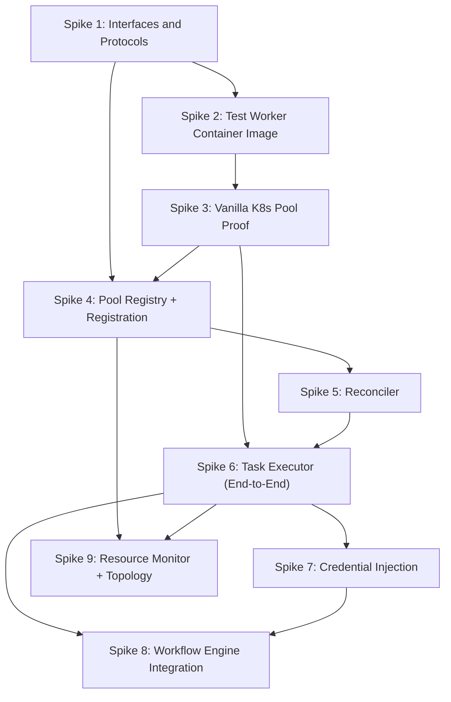

# Execution Plane — Development Spikes

Sequential spikes to validate the Execution Plane design and build toward integration with the Workflow Engine. Each spike builds on the previous and answers a specific feasibility question.

Companion documents: [execution-plane.md](execution-plane.md) (logical components), [execution-plane-invocation.md](execution-plane-invocation.md) (provisioner and dispatcher detail).

## Dependency Graph

## Spike 1: Interfaces and Protocols

Define the component contracts before any implementation. This is the foundation everything else plugs into.

**Scope:**
- `TaskDefinition` / `TaskResult` — what the Workflow Engine passes in and gets back
- `ProvisionerBackend` protocol — `acquire` / `release` / async variants
- `WorkerHandle` — what a claimed worker looks like to the caller
- `PoolRegistration` — the data model for a registered pool (name, endpoint, platform, backend, worker type, labels, status)
- `ReconcileResult` — structured result with `available_pools`, `exhausted_pools`, `ineligible_pools`, `outcome` enum
- `Reconciler` interface — `resolve_pool(task_requirements) -> ReconcileResult`
- `Dispatcher` interface — `dispatch(handle, payload, credentials) -> result`
- `TaskExecutor` interface — `execute_task(task_definition) -> task_result`

**Question answered:** Do the component boundaries hold? Can each component be developed and tested independently?

**Depends on:** Nothing.

## Spike 2: Test Worker Container Image

Build a minimal container image that represents a single workflow activity/node. This is the thing that actually runs inside a worker pod and implements the exec protocol.

**Scope:**
- `worker.py` — reads a JSON task payload from stdin, executes a simulated (or real) activity, writes a JSON result to stdout
- Support `--once` mode (exec-per-task) and long-running mode (PID 1 stays alive for the shared pool)
- Dockerfile based on the minimum-footprint EE base image concept
- Include a few representative activity types: HTTP call, shell command, echo/passthrough (for testing)
- Validate the JSON-lines protocol works cleanly over `pods/exec`

**Question answered:** Does the stdin/stdout JSON protocol work reliably through Kubernetes exec? What are the edge cases (large payloads, binary data, stderr interleaving)?

**Depends on:** Spike 1 (uses the `TaskDefinition`/`TaskResult` schemas for the wire format).

## Spike 3: Vanilla K8s Pool — Standalone Proof

Adapt the `k8s-agent-pool` prototype to prove the Lease-based shared pool works on OpenShift with the test worker image.

**Scope:**
- Deploy the pool manually: namespace, RBAC, worker Deployment (using the image from Spike 2)
- Prove Lease-based claiming: acquire a worker, hold the Lease, release it
- Prove exec dispatch: claim a worker, exec a task via stdin/stdout, collect the result
- Prove multi-scheduler: two concurrent schedulers sharing the same pool without double-claiming
- Prove pod replacement: kill a worker pod, observe the Deployment replaces it, observe the Lease expires
- Prove Lease expiry: simulate a scheduler crash, observe another scheduler reclaims the worker

**Question answered:** Does the Lease-based distributed locking work reliably on OpenShift? What's the claiming latency? What happens under contention?

**Depends on:** Spike 2 (needs the test worker image deployed in the pool).

## Spike 4: Pool Registry and Registration

Implement pool registration as a persistent, API-driven operation. This is the admin-time side — registering a cluster before it can be used at runtime.

**Scope:**
- `PoolRegistration` database model (SQLModel) — name, endpoint, platform, backend, worker type, labels, capacity, status
- CRUD API endpoints for pool registrations
- Registration status lifecycle: registering → validating → bootstrapping → active → failed
- Cluster Bootstrapper for vanilla K8s on OpenShift: create namespace, deploy RBAC, deploy worker Deployment
- Validation: endpoint reachability, credential verification
- Deregistration: drain workers, tear down bootstrapped resources, remove registration

**Question answered:** Can we automate the bootstrapping of a vanilla K8s pool on an OpenShift cluster through an API call? What fails, what needs manual intervention?

**Depends on:** Spike 1 (uses the `PoolRegistration` model), Spike 3 (the K8s manifests being automated are proven to work).

## Spike 5: Reconciler

Implement pool selection logic. Given a set of registered pools and a task's requirements, return a ranked list of eligible pools.

**Scope:**
- Read registered pools from the Pool Registry (Spike 4)
- Label matching: task affinity labels against pool labels
- Status filtering: exclude pools that are not `active`
- Capacity filtering: classify pools as available vs exhausted (requires basic worker count tracking)
- Return a structured `ReconcileResult` with `outcome` enum (`MATCHED`, `CAPACITY_EXHAUSTED`, `NO_MATCHING_POOLS`)
- Available pools ranked by capacity; exhausted pools included so the Task Executor can request scale-up

**Question answered:** Does label-based matching work for our use cases? Does the structured result give the Task Executor enough information for back-pressure decisions? How fast is the selection?

**Depends on:** Spike 4 (needs registered pools in the Pool Registry to select from).

## Spike 6: Task Executor — End-to-End Pipeline

Wire the Reconciler, Provisioner (vanilla K8s backend), and Dispatcher into the Task Executor's `execute_task` orchestration.

**Scope:**
- Implement `execute_task`: call Reconciler → acquire worker from selected pool → dispatch task → collect result → release worker
- Provisioning failure fallback: if acquire fails on the first pool, try the next in the ranked list
- Worker cleanup: ensure the worker is released regardless of task success or failure
- Error propagation: structured errors back to the caller (no pool available, provisioning failed, task failed, timeout)
- Timeout management: overall task timeout, provisioning timeout, dispatch timeout

**Question answered:** Does the full pipeline work end-to-end? What's the total latency from `execute_task` call to result? Where are the failure modes?

**Depends on:** Spike 3 (Provisioner/Dispatcher mechanics), Spike 5 (Reconciler for pool selection).

## Spike 7: Credential Injection

Prove that credentials can be securely delivered to a worker at dispatch time, scoped by workload type.

**Scope:**
- Integrate with Syntara's existing Credential Provider and `InjectorResolver`
- Resolve credentials for a task node's `credential_id` references
- Inject credentials into the exec payload (as part of the stdin JSON request or as exec env vars)
- Validate credentials are not persisted to disk in the worker pod (memory-backed only)
- Workload type filtering: demonstrate that an agentic task is denied access to automation credentials
- Credential scrubbing: ensure credentials don't leak into task output or logs

**Question answered:** Does the existing credential system integrate cleanly with the exec-based dispatch? Does workload-type isolation enforcement work?

**Depends on:** Spike 6 (needs the end-to-end pipeline to inject credentials into).

## Spike 8: Workflow Engine Integration

Connect the Task Executor to the real Workflow Engine. Route a workflow node through the Execution Plane instead of the current in-process execution path.

**Scope:**
- Identify the integration point in the Workflow Engine where node execution is dispatched (likely the Temporal activity implementation)
- Call `execute_task` for eligible node types (action nodes, agentic nodes) while preserving the existing path for nodes that don't need the Execution Plane
- Map the workflow node's configuration (EE image, credentials, affinity labels) into a `TaskDefinition`
- Map the `TaskResult` back into the workflow's activity output format
- End-to-end test: trigger a workflow with a node configured for Execution Plane dispatch, observe it routed to a worker pod, result returned to the workflow

**Question answered:** Can the Execution Plane be integrated into the Workflow Engine without disrupting the existing execution model? What's the latency overhead? Does the async completion / signal pattern still work?

**Depends on:** Spike 6 (Task Executor), Spike 7 (credentials).

## Spike 9: Resource Monitor and Topology View

Add observability — health probes, capacity tracking, and an admin-facing view of the Execution Plane.

**Scope:**
- Health probes for registered pools (poll pod readiness, track Lease utilisation)
- Capacity tracking: active workers vs pool max, current Lease holders
- Pool status transitions: active → degraded (health failures) → active (recovery)
- Feed capacity data into the Reconciler (Spike 5) for resource-aware pool selection
- Admin API endpoint: list pools with current status, worker count, capacity utilisation
- MVP topology view: list of pools and their workers (the "pod/agent list view" from the ANSTRAT-1803 planning)

**Question answered:** Can we observe the Execution Plane in real time? Does the Resource Monitor data improve Reconciler decisions?

**Depends on:** Spike 4 (Pool Registry), Spike 6 (running workers to observe).

## Summary

| Spike | Focus | Key Question | Pace |
|---|---|---|---|
| 1 | Interfaces and protocols | Do the component boundaries hold? | Days |
| 2 | Test worker container image | Does the stdin/stdout exec protocol work? | Days |
| 3 | Vanilla K8s pool proof | Does Lease-based claiming work on OpenShift? | Days |
| 4 | Pool Registry + Registration | Can we automate cluster bootstrapping via API? | ~1 week |
| 5 | Reconciler | Does label-based pool selection work? | Days |
| 6 | Task Executor (end-to-end) | Does the full pipeline work? | ~1 week |
| 7 | Credential injection | Do credentials flow securely to workers? | Days |
| 8 | Workflow Engine integration | Can we plug into the existing engine? | ~1 week |
| 9 | Resource Monitor + topology | Can we observe the Execution Plane? | ~1 week |

Spikes 1–3 prove the core mechanics with minimal dependencies. Spikes 4–6 build the runtime pipeline. Spikes 7–9 layer on security, integration, and observability.
