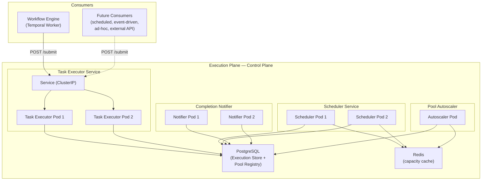
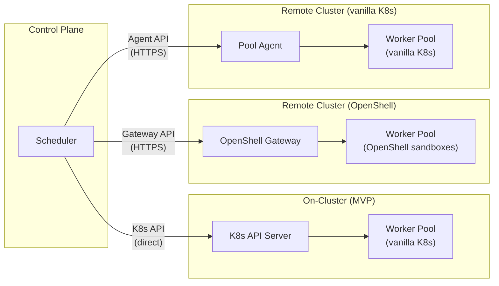
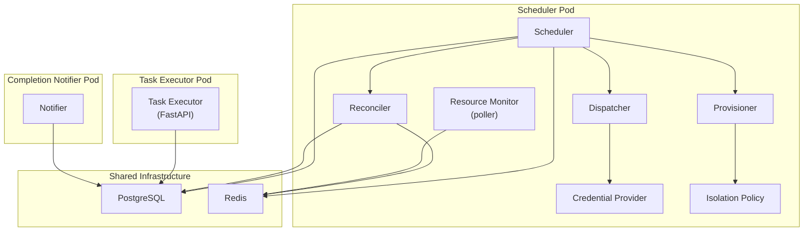
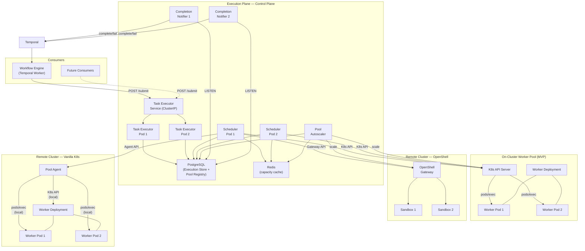

# Execution Plane — Deployment Topology

Deployment model for the Execution Plane components. Covers control-plane service decomposition, per-cluster provisioning models, and the rationale for a standalone Task Executor service.

Companion documents: [execution-plane.md](execution-plane.md) (logical components), [execution-plane-invocation.md](execution-plane-invocation.md) (provisioner and dispatcher detail), [execution-plane-authentication.md](execution-plane-authentication.md) (zero-trust boundaries), [execution-plane-spikes.md](execution-plane-spikes.md) (development spikes).

## Architecture Principles

1. **Durable submission, asynchronous execution.** The Task Executor accepts a task and persists it to the Execution Store. Scheduling, provisioning, and dispatch happen asynchronously. No HTTP connection or activity worker is held while a task waits for capacity or runs.
2. **Independent scaling axes.** API ingress, scheduling throughput, and completion delivery have different load profiles and scale independently.
3. **Latency-sensitive operations stay local.** Provisioning and dispatch (pods/exec, Lease operations) run on the same cluster as the workers — either directly via K8s API (on-cluster) or via a per-cluster gateway/agent (remote clusters).
4. **Blast-radius isolation.** A misbehaving execution workload (OOM, thread starvation, K8s API connection exhaustion) does not affect the Syntara API, UI, or other services.

## Standalone Service vs Library

The Task Executor is a standalone service, not a library embedded in the Syntara application. This is a deliberate architectural decision.

**Why standalone:**

| Concern | Standalone service | Embedded library |
|---|---|---|
| **Multiple consumers** | Any authorized service can submit work: Workflow Engine, scheduled jobs, event-driven triggers, external API callers, interactive/ad-hoc execution | Every consumer must go through the Syntara monolith process |
| **Independent scaling** | Scales on its own axis. Execution load is bursty and coordination-intensive — different profile from serving UI and REST API | Scaling the monolith for execution load wastes resources on API/UI replicas that don't need it |
| **Resilience boundary** | Process isolation contains blast radius. K8s API connection exhaustion or OOM in execution coordination does not take down the Syntara API | A misbehaving execution path degrades the entire application |
| **Deployment independence** | Execution Plane evolves rapidly (new provisioner backends, OpenShell Gateway integration, Pool Agent protocols). Ships independently of the Syntara release cycle | Every Execution Plane change requires redeploying and retesting all of Syntara |
| **Extraction cost** | Starting separate is cheaper than separating later. Once consumers depend on in-process calls, extracting to a network boundary is a painful migration | Library path has a ratchet — expedient now, expensive to reverse |

**Counterargument — operational overhead:** A standalone service is one additional Deployment with a health endpoint. The Execution Plane already requires its own Scheduler and Completion Notifier as separate processes, so the marginal cost of one more Deployment is small.

## Control Plane Services

The Execution Plane control plane comprises four deployable units plus shared infrastructure. All run on the Syntara cluster.

### Task Executor Service

The API entry point into the Execution Plane. Accepts task submissions, persists them durably, and returns immediately.

| Aspect | Decision |
|---|---|
| Workload type | Deployment (stateless) |
| Minimum replicas | 2 (availability during rolling updates) |
| Service type | ClusterIP (internal for MVP; Ingress/Route for external consumers in future) |
| Scaling | HPA on request rate for production; fixed replicas for MVP |
| Health checks | Readiness probe on `/health`; liveness probe on process health |

**Responsibilities:**
- Authenticate and authorize the caller (mTLS + `ClientCertAuthMiddleware` for service callers; JWT for user-initiated submissions)
- Validate the task definition
- Idempotently persist a queued `Execution` with its completion target
- Return the execution ID without waiting for scheduling or completion
- Expose cancellation and status lookup endpoints

**Statelessness:** Every request is self-contained. No in-process queue, no session affinity, no local cache. The Execution Store (PostgreSQL) is the single source of truth. If a pod dies, in-flight submissions fail and the caller retries; no durable state is lost because submission is transactional.

### Scheduler Service

Claims queued executions and orchestrates assignment — pool selection, capacity reservation, provisioning, and dispatch. This is the heaviest component: it holds connections to remote provisioning targets and manages long-running dispatch operations.

| Aspect | Decision |
|---|---|
| Workload type | Deployment (stateless) |
| Minimum replicas | 2 |
| Scaling | HPA on queue depth and scheduling latency |
| Coordination | PostgreSQL row locks and unique constraints prevent double-claiming. No inter-replica communication needed |

**Responsibilities:**
- Claim queued executions using transactional locking
- Apply project quotas, priority, aging, and per-workflow concurrency limits
- Ask the Reconciler for eligible pools
- Atomically reserve capacity and create a fenced execution attempt
- Acquire a worker (via K8s API, OpenShell Gateway, or Pool Agent depending on pool type)
- Dispatch the task and collect the result
- Persist terminal state + completion outbox event atomically
- Release workers on completion, failure, or timeout
- Retry retryable provisioning failures with bounded exponential backoff and jitter

**Why separate from Task Executor:** The Scheduler holds long-lived connections to provisioning targets (K8s API, OpenShell Gateway). These connections can stall, timeout, or exhaust connection pools under load. Isolating them from the submission API prevents a slow remote cluster from degrading submission throughput.

### Completion Notifier

Delivers terminal results to callers without caller-side polling.

| Aspect | Decision |
|---|---|
| Workload type | Deployment |
| Replicas | 2 (availability; only one actively listens, the other is standby) |
| Coordination | Leader election via Kubernetes Lease, or both listen with idempotent delivery |

**Responsibilities:**
- Maintain a PostgreSQL `LISTEN` connection on the completion channel
- Claim outbox events and complete/fail the corresponding Temporal asynchronous activity
- Drain undelivered outbox rows on startup and reconnection
- Periodic reconciliation sweep as a final safeguard

**Why separate:** The Completion Notifier has a fundamentally different execution model — it holds a persistent database connection and reacts to notifications, rather than processing requests. Co-locating it with the Scheduler would complicate lifecycle management and scaling.

### Pool Autoscaler

Calculates desired pool capacity from aggregated queue demand and adjusts pool size.

| Aspect | Decision |
|---|---|
| Workload type | Deployment |
| Replicas | 1 (leader-elected; scales pools, not itself) |
| Coordination | Leader election via Kubernetes Lease |

**Responsibilities:**
- Read eligible queued demand by pool/profile from the Execution Store
- Read current capacity (ready, starting, reserved) from the Resource Monitor
- Calculate absolute desired capacity per pool
- Apply desired capacity to the provisioning target (K8s Deployment scale, OpenShell Gateway pool resize)
- Respect configured pool minimums and maximums

**Why separate:** Autoscaling is a control loop with its own cadence (seconds, not per-request). Running it in the Scheduler would couple scaling decisions to scheduling throughput.

## Per-Cluster Provisioning

The Execution Plane supports multiple provisioning models. The choice depends on the pool's provisioner backend and cluster location.

### Direct K8s API (on-cluster, MVP)

For vanilla K8s pools on the same cluster as the control plane, the Scheduler talks directly to the K8s API server using its ServiceAccount token.

| Aspect | Detail |
|---|---|
| Provisioning | Lease-based worker claiming via K8s API |
| Dispatch | `pods/exec` via K8s API |
| Health/capacity | Resource Monitor polls pod readiness and Lease utilisation |
| Latency | Sub-millisecond (same cluster) |
| Authentication | Bound ServiceAccount token + RBAC (see [authentication doc](execution-plane-authentication.md), boundary ②) |

This is the MVP model. The Scheduler, K8s API, and Worker Pool are all on the same cluster, so direct API calls are low-latency and reliable.

### OpenShell Gateway (OpenShell pools)

For OpenShell pools, the Scheduler communicates with the OpenShell Gateway rather than the K8s API directly. The Gateway handles sandbox provisioning, Lease management, credential injection, and dispatch internally.

| Aspect | Detail |
|---|---|
| Provisioning | Gateway creates/claims sandboxes per its pool configuration |
| Dispatch | Gateway handles task delivery to the sandbox |
| Health/capacity | Gateway reports pool health and capacity to the Scheduler |
| Latency | Variable (Gateway may be on a remote cluster) |
| Authentication | mTLS or short-lived token between Scheduler and Gateway |

**Key insight:** The OpenShell Gateway is the per-cluster agent for OpenShell pools. It already encapsulates the pattern of "push heavy operations to where the workers are." The Scheduler sends a single request ("execute this task in this pool") and the Gateway handles everything locally — provisioning, credential injection, dispatch, result collection.

The Provisioner Backend abstraction accommodates this cleanly. The `OpenShellProvisionerBackend` implementation translates `acquire`/`release`/`dispatch` into Gateway API calls instead of K8s API calls. The Scheduler and upstream components are unaware of the difference.

### Pool Agent (vanilla K8s remote clusters, future)

For vanilla K8s pools on remote clusters without OpenShell, a lightweight Pool Agent provides the same local-execution pattern as the OpenShell Gateway.

| Aspect | Detail |
|---|---|
| Provisioning | Agent performs Lease-based worker claiming locally via K8s API |
| Dispatch | Agent performs `pods/exec` locally |
| Health/capacity | Agent reports capacity back to the control plane |
| Latency | Single API call from Scheduler to Agent; all K8s operations are local to the remote cluster |
| Authentication | mTLS or short-lived token between Scheduler and Agent (see [authentication doc](execution-plane-authentication.md), boundary ④) |
| Scope | ANSTRAT-2337 (remote OpenShift cluster execution) |

**Why not just use K8s API remotely?** Provisioning and dispatch require multiple sequential K8s API calls (query pods, acquire Lease, pods/exec, collect result). Over a high-latency link, each round-trip adds delay and each call is a failure point. The Pool Agent collapses this to a single Scheduler→Agent call, with all K8s operations local to the remote cluster.

**Relationship to OpenShell Gateway:** The Pool Agent and OpenShell Gateway serve the same architectural role — a per-cluster service that handles provisioning and dispatch locally. If OpenShell is adopted universally, the Pool Agent may not be needed. If vanilla K8s remote pools are required without OpenShell, the Pool Agent fills the gap.

## Component Mapping

Where each logical component from [execution-plane.md](execution-plane.md) runs:

| Component | Location | Rationale |
|---|---|---|
| **Task Executor** | Standalone Deployment + Service | API gateway; independent scaling and resilience boundary |
| **Scheduler** | Standalone Deployment | Long-lived connections to provisioning targets; heaviest coordination logic |
| **Execution Store** | PostgreSQL (shared Syntara database) | Durable coordination; transactional outbox |
| **Completion Notifier** | Standalone Deployment | Persistent LISTEN connection; different execution model from request processing |
| **Pool Autoscaler** | Standalone Deployment (single leader) | Control loop with its own cadence |
| **Reconciler** | Library within Scheduler | Pure query logic over Pool Registry and Resource Monitor data |
| **Provisioner** | Library within Scheduler | Calls K8s API / OpenShell Gateway / Pool Agent. Shared connection management with Scheduler |
| **Dispatcher** | Library within Scheduler | Calls provisioning target for task delivery. Same connection as Provisioner |
| **Credential Provider** | Library within Scheduler | Resolves credentials from Syntara's credential system before dispatch |
| **Isolation Policy** | Library within Scheduler | Policy evaluation logic; no external dependencies |
| **Resource Monitor** | Background poller within Scheduler (MVP) | Polls K8s API / Gateway for capacity; writes to Redis cache |
| **Pool Registry** | PostgreSQL (shared Syntara database) | Durable pool registrations |
| **Registration Provider** | Syntara API (or standalone, TBD) | Admin-time CRUD; low frequency, no need for a dedicated service |

## Scheduler Statelessness

Scheduler replicas are stateless. All coordination uses PostgreSQL:

| Scenario | Mechanism |
|---|---|
| Two replicas claim the same queued execution | `SELECT ... FOR UPDATE SKIP LOCKED` — only one wins |
| Two replicas reserve capacity in the same pool | Atomic `UPDATE ... WHERE available >= requested` — races resolve at the database |
| Replica dies mid-dispatch | Execution attempt has a fencing token; the attempt times out and the execution returns to the queue for re-assignment. Worker Lease expires (30s TTL) |
| Replica dies mid-provisioning | Capacity reservation has an expiry; it releases automatically. The execution returns to the queue |

No inter-replica communication, no distributed locks, no in-memory state. PostgreSQL is the coordination layer.

## Network and RBAC

### Kubernetes RBAC

The Scheduler's ServiceAccount needs permissions to interact with on-cluster Worker Pool namespaces:

| Resource | Verbs | Scope | Purpose |
|---|---|---|---|
| `pods` | get, list, watch | Worker Pool namespace(s) | Discover available workers, check readiness |
| `pods/exec` | create | Worker Pool namespace(s) | Dispatch tasks to workers via exec |
| `leases` | get, list, watch, create, update | Worker Pool namespace(s) | Claim and release workers |
| `deployments` | get, patch | Worker Pool namespace(s) | Read current replica count |
| `deployments/scale` | get, update | Worker Pool namespace(s) | Scale subresource (used by Pool Autoscaler) |

For remote clusters, RBAC is handled by the Pool Agent or OpenShell Gateway on the remote cluster. The Scheduler's ServiceAccount does not need permissions on remote clusters.

### Network Access

**Task Executor:**

| Target | Protocol | Purpose |
|---|---|---|
| PostgreSQL | TCP/5432 | Execution Store (persist submissions) |

**Scheduler:**

| Target | Protocol | Purpose |
|---|---|---|
| PostgreSQL | TCP/5432 | Execution Store, Pool Registry, Credential Provider |
| Redis | TCP/6379 | Resource Monitor capacity cache |
| K8s API Server | HTTPS/6443 | On-cluster provisioning and dispatch (MVP) |
| OpenShell Gateway | HTTPS (configurable) | OpenShell pool provisioning and dispatch |
| Pool Agent | HTTPS (configurable) | Remote vanilla K8s provisioning and dispatch |

**Completion Notifier:**

| Target | Protocol | Purpose |
|---|---|---|
| PostgreSQL | TCP/5432 | LISTEN/NOTIFY + outbox drain |
| Temporal | gRPC (configurable) | Complete/fail async activities |

**Pool Autoscaler:**

| Target | Protocol | Purpose |
|---|---|---|
| PostgreSQL | TCP/5432 | Read queue demand |
| Redis | TCP/6379 | Read current capacity |
| K8s API Server | HTTPS/6443 | Scale on-cluster Deployments |
| OpenShell Gateway | HTTPS (configurable) | Scale OpenShell pools |

## Full Topology

## MVP Constraints

| Constraint | MVP | Future |
|---|---|---|
| Cluster topology | Single cluster (all control plane + workers on the same OpenShift cluster) | Multi-cluster via ANSTRAT-2337, ANSTRAT-2338 |
| Provisioning model | Direct K8s API (vanilla K8s, warm pool) | OpenShell Gateway, Pool Agent |
| Task Executor replicas | Fixed at 2 | HPA on request rate |
| Scheduler replicas | Fixed at 2 | HPA on queue depth |
| Completion Notifier | 2 replicas, both listen with idempotent delivery | Leader-elected or partitioned by execution range |
| Pool Autoscaler | 1 replica, leader-elected | Unchanged (single leader is sufficient) |
| Resource Monitor | Background poller in Scheduler; Redis-cached, eventually consistent | Dedicated service with K8s watch streams, or delegated to Gateway/Agent |
| Service exposure | ClusterIP (internal only) | Ingress/Route for external consumers |
| Registration Provider | TBD (may live in Syntara API or as standalone) | Standalone if registration volume warrants it |
