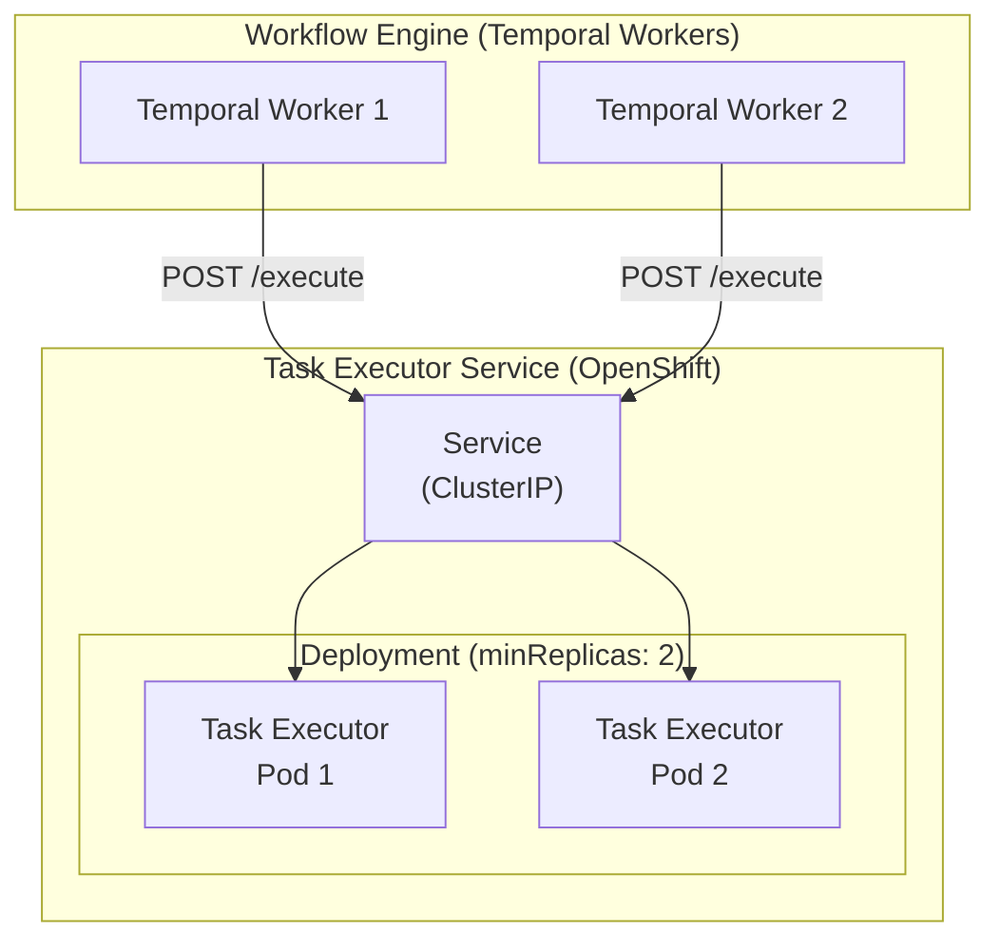
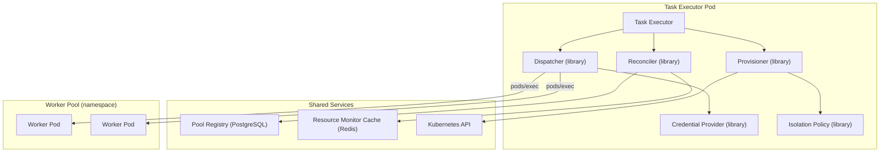
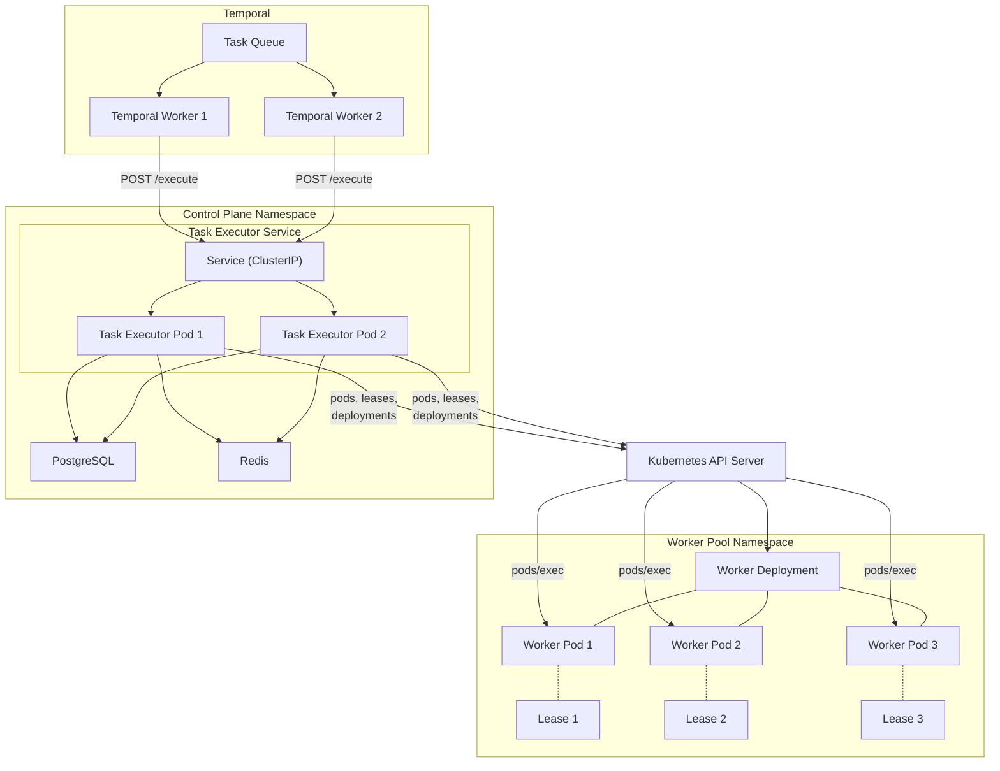

# Execution Plane — Deployment Topology

Deployment model for the Execution Plane components on OpenShift.

Companion documents: [execution-plane.md](execution-plane.md) (logical components), [execution-plane-invocation.md](execution-plane-invocation.md) (provisioner and dispatcher detail), [execution-plane-spikes.md](execution-plane-spikes.md) (development spikes).

## Task Executor Service

The Task Executor is the front door into the Execution Plane. It exposes a REST API that the Workflow Engine calls to execute task nodes. It is deployed as a standalone, stateless service on OpenShift.

### Deployment Model

| Aspect | Decision |
|---|---|
| Workload type | Deployment (not StatefulSet — no persistent identity needed) |
| Minimum replicas | 2 (ensures availability during rolling updates and single-pod failures) |
| Service type | ClusterIP (internal-only; the Workflow Engine is in the same cluster for MVP) |
| Scaling | HorizontalPodAutoscaler on CPU/request-rate for production; fixed replicas for MVP |
| Image | Standalone container image built from the Syntara backend codebase |
| Health checks | Readiness probe on the REST API health endpoint; liveness probe on process health |

### Statelessness

The Task Executor holds **no durable state**. Every request is self-contained:

- **No in-process task queue.** The back-pressure retry loop (polling the Reconciler, waiting for capacity) executes within a single HTTP request lifecycle. If the pod dies mid-wait, no queued work is lost — there is nothing queued.
- **No session affinity.** Any replica can serve any request. The Service uses default round-robin load balancing.
- **No local cache.** Pool metadata and capacity data are read from the Pool Registry and Resource Monitor on each request.

This statelessness is possible because **Temporal is the durable retry layer**. The Workflow Engine invokes `execute_task` as a Temporal activity. If a Task Executor pod dies mid-execution:

1. The HTTP request fails (connection reset or timeout).
2. Temporal detects the activity failure.
3. Temporal retries the activity, which sends a new `POST /execute` to the Service.
4. The Service routes the request to a healthy replica.
5. The new replica starts the full pipeline from scratch (reconcile → provision → dispatch).

No coordination between replicas is needed. No work is lost. The worker that was provisioned (if any) will be released by Lease expiry (30s TTL).

### Concurrent Replica Behaviour

With multiple replicas independently serving requests:

| Scenario | Behaviour | Why it's safe |
|---|---|---|
| Two replicas claim workers from the same pool | Each acquires a different worker via Lease-based locking (409 Conflict prevents double-claim) | Lease optimistic concurrency is designed for this |
| Two replicas request scale-up for the same pool | Provisioner treats scale-up as idempotent — pool won't exceed its configured maximum | Deployment replica count is capped; duplicate requests are no-ops once at max |
| Replica dies while holding a worker | Lease expires after 30s; worker returns to the available pool | Lease TTL is the safety net |
| Replica dies mid-back-pressure wait | No state lost — Temporal retries the activity on a different replica | Retry loop is in-request, not persistent |

### REST API Surface

The Task Executor exposes a minimal API. The primary consumer is the Workflow Engine (via Temporal activity code).

| Endpoint | Method | Purpose |
|---|---|---|
| `/execute` | POST | Execute a task node — the main entry point |
| `/health` | GET | Readiness/liveness probe |

The `/execute` endpoint accepts a `TaskDefinition` and returns a `TaskResult` (or a structured error). It is a synchronous, long-running request — the HTTP connection stays open until the task completes or times out.

For MVP, this synchronous model is sufficient because:
- Temporal activities already support long-running operations with heartbeats.
- The Temporal activity sets an appropriate `start_to_close_timeout` that exceeds the maximum expected task duration.
- The Task Executor can send periodic heartbeats back through the Temporal activity to prevent Temporal from timing out the activity while the task is still running.

## Component Co-Location

Not every Execution Plane component runs as a separate service. Some are libraries consumed by the Task Executor process; others are shared infrastructure services.

| Component | Deployment | Rationale |
|---|---|---|
| Task Executor | Standalone service (Deployment + Service) | Front door; needs independent scaling, health checks, and rolling updates |
| Reconciler | Library within the Task Executor process | Pure query logic; no I/O beyond reading the Pool Registry and Resource Monitor. No reason to pay the network hop |
| Provisioner | Library within the Task Executor process | Calls the Kubernetes API directly. Shared K8s client configuration with the Task Executor |
| Dispatcher | Library within the Task Executor process | Calls `pods/exec` via the Kubernetes API. Same client as the Provisioner |
| Credential Provider | Library within the Task Executor process | Integrates with Syntara's existing credential system (database + AES-256-GCM decryption). Must run in-process for secure key access |
| Isolation Policy | Library within the Task Executor process | Policy evaluation logic; no external dependencies |
| Pool Registry | PostgreSQL (shared Syntara database) | Durable storage for pool registrations; shared with the rest of the Syntara backend |
| Resource Monitor | Redis (shared Syntara Redis) + periodic polling | Capacity and health data cached in Redis; a background poller in the Task Executor updates it |

### Resource Monitor Polling

The Resource Monitor is not a separate service for MVP. Instead, each Task Executor replica runs a lightweight background poller that:

1. Queries each registered Worker Pool for pod readiness and Lease utilisation (via the Kubernetes API).
2. Writes capacity snapshots to Redis with a short TTL (e.g. 15s).
3. The Reconciler reads these snapshots when evaluating pool capacity.

This means capacity data is eventually consistent (up to the polling interval behind reality). For MVP this is acceptable — the Lease-based locking at the Provisioner level is the true concurrency guard. The Reconciler uses capacity data for routing hints, not for correctness.

## Network and RBAC

### Kubernetes RBAC

The Task Executor's ServiceAccount needs permissions to interact with Worker Pool namespaces:

| Resource | Verbs | Scope | Purpose |
|---|---|---|---|
| `pods` | get, list, watch | Worker Pool namespace(s) | Discover available workers, check readiness |
| `pods/exec` | create | Worker Pool namespace(s) | Dispatch tasks to workers via exec |
| `leases` | get, list, watch, create, update | Worker Pool namespace(s) | Claim and release workers via Lease-based locking |
| `deployments` | get, patch | Worker Pool namespace(s) | Scale-up worker Deployments (back-pressure) |
| `deployments/scale` | get, update | Worker Pool namespace(s) | Scale subresource for HPA-compatible scaling |

For MVP (single on-cluster pool), a single Role + RoleBinding in the Worker Pool namespace is sufficient. For multi-cluster support (ANSTRAT-2337), cross-cluster RBAC or a per-cluster agent model will be needed.

### Network Policy

The Task Executor needs network access to:

| Target | Protocol | Purpose |
|---|---|---|
| Kubernetes API server | HTTPS (tcp/6443) | Pod management, exec, Leases, Deployments |
| PostgreSQL | TCP (tcp/5432) | Pool Registry, Credential Provider |
| Redis | TCP (tcp/6379) | Resource Monitor capacity cache |
| Worker Pods | via Kubernetes API (not direct) | Task dispatch is through `pods/exec`, not direct network |

Worker Pods do **not** need network access back to the Task Executor. Results are returned through the `pods/exec` stdout stream.

## Topology Diagram

Full deployment topology showing all runtime components:

## MVP Constraints

| Constraint | MVP | Future |
|---|---|---|
| Cluster topology | Single cluster (Task Executor and Worker Pool on the same OpenShift cluster) | Multi-cluster via ANSTRAT-2337 |
| Task Executor replicas | Fixed at 2 | HPA-driven auto-scaling |
| Resource Monitor | Background poller in each Task Executor replica; Redis-cached | Dedicated service with push-based updates (Kubernetes watch streams) |
| Service exposure | ClusterIP (internal only) | Potentially Ingress/Route for cross-cluster callers |
| Scaling model | Synchronous scale-up requests from Task Executor to Provisioner | Event-driven autoscaler watching queue depth and capacity trends |
