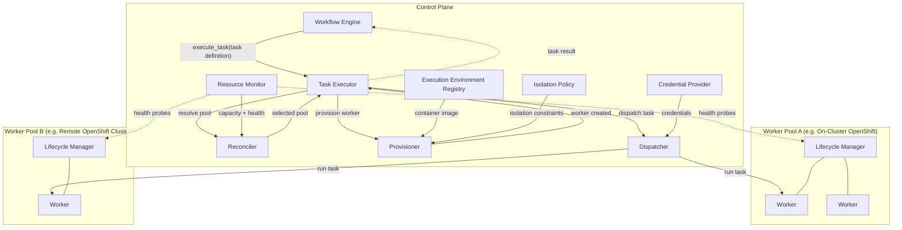
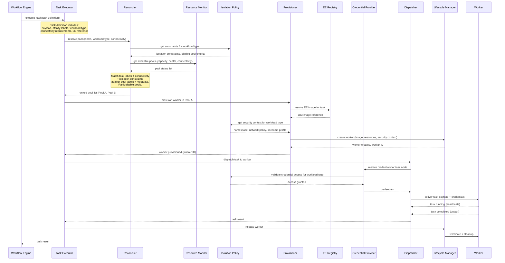
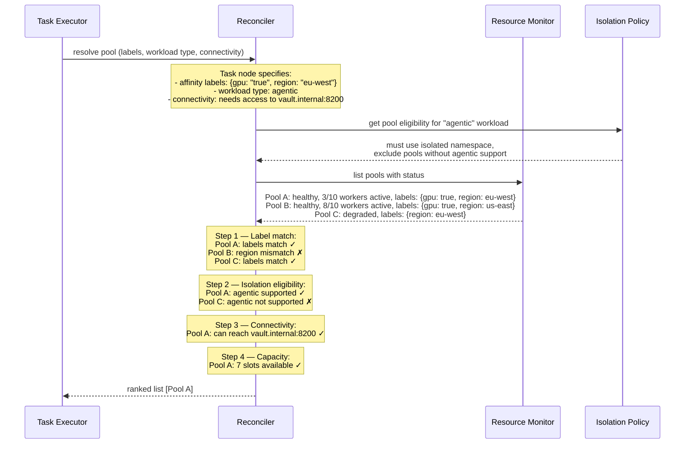
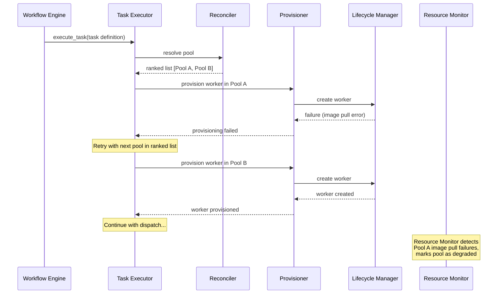
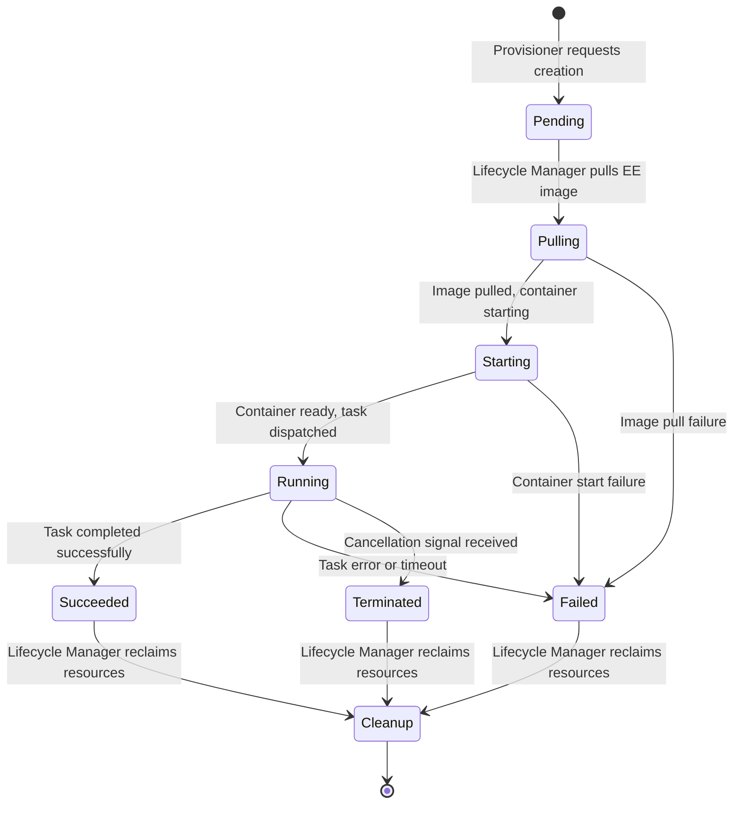
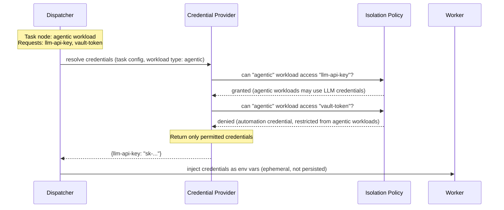
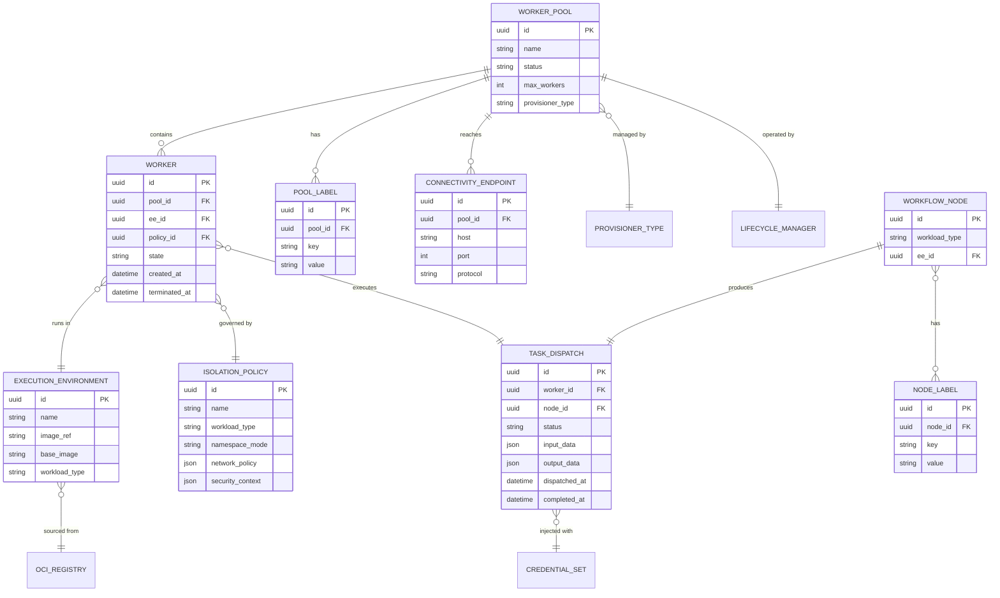

# Execution Plane

Design document for the Execution Plane — the subsystem that routes, provisions, and dispatches workflow task node workloads to isolated compute workers.

Reference: [ANSTRAT-1803](https://redhat.atlassian.net/browse/ANSTRAT-1803) — Workflow Automation: Execution Plane (MVP: On-Cluster OpenShift).

## Logical Components

The Execution Plane comprises the following logical components:

### Task Executor

The single entry point into the Execution Plane. The Workflow Engine calls `execute_task(task_definition)` and receives a result — it has no knowledge of pools, provisioning, or dispatch internals. The Task Executor owns the full orchestration pipeline: Reconciler, Provisioner, Dispatcher, and cleanup.

**Responsibilities:**
- Accept a task definition from the Workflow Engine (task payload, affinity labels, workload type, connectivity requirements, EE reference)
- Orchestrate the execution pipeline: reconcile a pool, provision a worker, dispatch the task, collect the result
- Handle provisioning failures by retrying with fallback pools from the Reconciler's ranked list
- Return the task result (or a structured error) to the Workflow Engine
- Ensure worker cleanup occurs regardless of task outcome (delegates to the Lifecycle Manager)

**Interface:**
- `execute_task(task_definition) -> task_result` — the only method the Workflow Engine calls
- The task definition includes: task payload (inputs, parameters), affinity labels, workload type (action/agentic), connectivity requirements, EE image reference, credential references, resource requirements (CPU, memory, timeout)

### Worker

The smallest granular compute unit. A Worker executes a single workflow task node within a sandboxed container. Each Worker is ephemeral — created for a task, destroyed after completion.

**Responsibilities:**
- Execute the dispatched task within its Execution Environment container
- Report task status (running, completed, failed) back to the Dispatcher
- Enforce resource limits (CPU, memory, timeout) as defined by its configuration

**Key attributes:**
- Compute requirements (CPU, memory, storage)
- Assigned Execution Environment (container image)
- Applied Isolation Policy
- Injected credentials
- Lifecycle state (pending, running, succeeded, failed, terminated)

### Worker Pool

A logical grouping of Workers representing a deployment target — for example, an OpenShift cluster or namespace. A Worker Pool is the unit at which administrators configure capacity, connectivity, and placement policy. It is the singular logical Execution Plane in which Workers can be provisioned.

**Responsibilities:**
- Define the boundary within which Workers are provisioned
- Advertise capacity, connectivity metadata, and health to the Resource Monitor
- Support label-based selection by the Reconciler

**Key attributes:**
- Labels (key/value pairs for affinity matching)
- Connectivity metadata (reachable network endpoints, segments, geographies)
- Capacity limits (max concurrent Workers, resource quotas)
- Provisioner type (which Provisioner implementation manages this pool)
- Status (online, degraded, offline)

### Reconciler

Selects a Worker Pool in which to provision a Worker for a given task node. The Reconciler evaluates task requirements against available Worker Pools, considering labels, connectivity, capacity, and isolation constraints.

**Responsibilities:**
- Match task node affinity labels against Worker Pool labels
- Evaluate connectivity requirements (can the pool reach the endpoints this task needs?)
- Consult the Resource Monitor for available capacity
- Apply Isolation Policy constraints (e.g. agentic workloads excluded from certain pools)
- Return a ranked list of eligible Worker Pools (or fail if none match)

**Inputs:**
- Task node label selectors and affinity rules
- Task node connectivity requirements
- Workload type (deterministic action vs. agentic)
- Resource Monitor data (capacity, health, connectivity metadata)

### Provisioner

Creates a Worker within the selected Worker Pool. The Provisioner is an abstraction over the underlying infrastructure — different implementations handle different pool types (OpenShift pods, OpenShell sandboxes, Agent Sandbox, etc.).

**Responsibilities:**
- Create the Worker compute resource in the target pool
- Pull and apply the specified Execution Environment container image
- Apply Isolation Policy constraints (namespace isolation, network policies, seccomp profiles)
- Configure resource limits per the Worker definition
- Report provisioning status (success, failure, timeout)

**Key design constraint:** The Provisioner interface is implementation-agnostic. New provisioner types (e.g. OpenShell, RHEL execution nodes) can be added without rearchitecting the interface.

### Dispatcher

Delivers the workflow task payload to a provisioned Worker and manages the task execution lifecycle.

**Responsibilities:**
- Inject credentials into the Worker via the Credential Provider
- Deliver the task payload (inputs, parameters, Execution Environment configuration)
- Monitor task execution (heartbeats, timeouts)
- Collect task output and return it to the Task Executor
- Handle task failure, retry, and cancellation signals

### Execution Environment (EE) Registry

Manages the catalogue of container images available for task execution. An Execution Environment defines the software stack (Python packages, Ansible collections, system libraries) that a task node runs within.

**Responsibilities:**
- Maintain a catalogue of available EE images and their metadata
- Validate that EE images are sourced from OCI-compliant registries accessible from the target Worker Pool
- Provide the Provisioner with the image reference to pull when creating a Worker
- Support a minimum-footprint base image for building custom EEs

**Key attributes per EE:**
- OCI image reference (registry/repository:tag)
- Supported workload types (action, agentic, both)
- Required capabilities or system libraries
- Build lineage (base image, build tool version)

### Resource Monitor

Observes and reports the state of all Worker Pools and their Workers. Provides the data layer that feeds the Reconciler's placement decisions and the administrator's topology view.

**Responsibilities:**
- Probe Worker Pool health (liveness, readiness)
- Track per-pool resource availability (compute capacity, active workload count)
- Collect connectivity metadata (what endpoints each pool can reach)
- Expose metrics for administrator dashboards and topology views
- Detect and report degraded or offline pools

### Credential Provider

Securely injects credentials into Workers at dispatch time. Enforces workload-type isolation — agentic workers must not receive automation credentials, and vice versa.

**Responsibilities:**
- Resolve which credentials a task node requires based on its configuration
- Enforce credential access policies based on workload type and Isolation Policy
- Inject credentials into the Worker's environment securely (not persisted to disk, not logged)
- Support credential rotation without Worker restart

### Isolation Policy

Defines the security and governance boundaries applied to Workers based on workload type. Separates deterministic action workloads from agentic AI workloads to reflect their distinct trust requirements.

**Responsibilities:**
- Classify workloads by type (deterministic action vs. agentic AI)
- Define isolation level per workload type (namespace isolation, network policies, resource constraints)
- Restrict credential access by workload type
- Inform the Provisioner of required container security context (seccomp, AppArmor, capabilities)
- Provide the Reconciler with pool eligibility constraints

**MVP scope:** Container isolation + namespace separation within OpenShift. The interface accommodates future policy-based sandboxing (e.g. OpenShell) without rearchitecting.

### Lifecycle Manager

Manages Workers from creation to cleanup within a Worker Pool. Operates as a per-pool component.

**Responsibilities:**
- Track all Workers in the pool (pending, running, completed, failed)
- Enforce pool-level capacity limits (reject provisioning requests when at capacity)
- Reclaim resources from completed or failed Workers (container cleanup, volume teardown)
- Handle Worker failures (detect unresponsive Workers, mark as failed, trigger re-provisioning if policy allows)
- Report pool state to the Resource Monitor

## Sequence Diagrams

### Task Execution: Happy Path

The complete flow from a workflow task node becoming ready to execute, through worker selection, provisioning, and dispatch, to result delivery. The Workflow Engine calls `execute_task` on the Task Executor and receives a result — it has no visibility into the internal pipeline.

### Reconciliation: Pool Selection Logic

Detail of how the Reconciler evaluates candidate pools. The Task Executor calls the Reconciler; the Workflow Engine is not involved.

### Provisioning Failure and Fallback

What happens when provisioning fails in the selected pool. The Task Executor handles the retry logic internally — the Workflow Engine is unaware of the fallback.

### Worker Lifecycle

The lifecycle of a Worker from creation through cleanup.

### Credential Injection with Isolation

How credentials are scoped by workload type.

## Entity Relationships

## MVP Scope (On-Cluster OpenShift)

Per the July 2026 planning decisions ([ANSTRAT-1803](https://redhat.atlassian.net/browse/ANSTRAT-1803) comments):

| Component | MVP Scope |
|---|---|
| Task Executor | Single `execute_task` entry point for the Workflow Engine; orchestrates the full pipeline |
| Worker | OpenShift pod within the control plane cluster |
| Worker Pool | Single on-cluster pool (same namespace or dedicated namespace) |
| Reconciler | Global affinity only; project/workflow/node-level affinity deferred |
| Provisioner | OpenShift pod provisioner (Kubernetes API). Implementation-agnostic interface |
| Dispatcher | Deliver task payload, collect results |
| EE Registry | OCI image references from customer-accessible registries |
| Resource Monitor | Pod/agent list view for administrators |
| Credential Provider | Credential injection scoped by workload type |
| Isolation Policy | Container isolation + namespace separation (no OpenShell/policy-based sandboxing) |
| Lifecycle Manager | Pod lifecycle management (create, monitor, cleanup) |

### Future Phases

- **[ANSTRAT-2337](https://redhat.atlassian.net/browse/ANSTRAT-2337):** External OpenShift cluster execution (polling and push connectivity to remote OCP clusters)
- **[ANSTRAT-2338](https://redhat.atlassian.net/browse/ANSTRAT-2338):** External RHEL execution (hop nodes and execution nodes on RHEL)
- Per-project, per-workflow, and per-node affinity rules
- Policy-based sandboxing (OpenShell integration)
- EE build tooling (extending ansible-builder or new tool)
