# Execution Plane

Design document for the Execution Plane — the subsystem that routes, provisions, and dispatches workflow task node workloads to isolated compute workers.

Reference: [ANSTRAT-1803](https://redhat.atlassian.net/browse/ANSTRAT-1803) — Workflow Automation: Execution Plane (MVP: On-Cluster OpenShift).

## Logical Components

The Execution Plane comprises the following logical components:

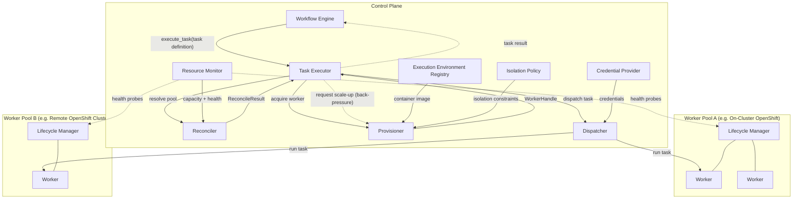

**Simplified view — critical path only:**

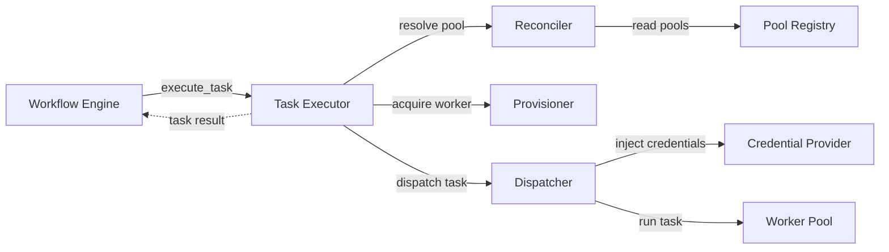

### Task Executor

The single entry point into the Execution Plane. The Workflow Engine calls `execute_task(task_definition)` and receives a result — it has no knowledge of pools, provisioning, or dispatch internals. The Task Executor owns the full orchestration pipeline: Reconciler, Provisioner, Dispatcher, and cleanup.

**Responsibilities:**
- Accept a task definition from the Workflow Engine (task payload, affinity labels, workload type, connectivity requirements, EE reference)
- Orchestrate the execution pipeline: reconcile a pool, provision a worker, dispatch the task, collect the result
- Handle provisioning failures by retrying with fallback pools from the Reconciler's ranked list
- **Handle back-pressure:** when the Reconciler returns `CAPACITY_EXHAUSTED`, queue the task and attempt corrective action (see [Back-Pressure and Capacity Management](#back-pressure-and-capacity-management))
- Return the task result (or a structured error) to the Workflow Engine
- Ensure worker cleanup occurs regardless of task outcome (delegates to the Lifecycle Manager)

**Back-pressure handling:**

The Task Executor is the decision-maker for back-pressure. When the Reconciler reports that matching pools exist but have no available capacity, the Task Executor takes corrective action:

| Reconciler outcome | Task Executor action |
|---|---|
| `MATCHED` | Proceed immediately — acquire worker from the best available pool |
| `CAPACITY_EXHAUSTED` | Queue the task, request pool scale-up via the Provisioner, re-poll until capacity frees or timeout expires |
| `NO_MATCHING_POOLS` | Fail immediately with a structured error — no corrective action possible |

The scale-up request is delegated to the Provisioner, which knows how to add capacity to a given pool (e.g. scaling a Deployment's replica count for vanilla K8s pools). The Provisioner may decline the request if the pool is already at its configured maximum.

**Interface:**
- `execute_task(task_definition) -> task_result` — the only method the Workflow Engine calls
- The task definition includes: task payload (inputs, parameters), affinity labels, workload type (action/agentic), connectivity requirements, EE image reference, credential references, resource requirements (CPU, memory, timeout)

### Worker

The smallest granular compute unit. A Worker executes a single workflow task node within a sandboxed container. Each Worker is ephemeral — created for a task, destroyed after completion.

**Responsibilities:**
- Execute the dispatched task within its Execution Environment container
- Report task status (running, completed, failed) back to the Dispatcher
- Enforce resource limits (CPU, memory, timeout) as defined by its configuration

**Key attributes:**
- Compute requirements (CPU, memory, storage)
- Assigned Execution Environment (container image)
- Applied Isolation Policy
- Injected credentials
- Lifecycle state (pending, running, succeeded, failed, terminated)

### Worker Pool

A logical grouping of Workers representing a deployment target — for example, an OpenShift cluster or namespace. A Worker Pool is the unit at which administrators configure capacity, connectivity, and placement policy. It is the singular logical Execution Plane in which Workers can be provisioned.

**Responsibilities:**
- Define the boundary within which Workers are provisioned
- Advertise capacity, connectivity metadata, and health to the Resource Monitor
- Support label-based selection by the Reconciler

**Key attributes:**
- Labels (key/value pairs for affinity matching)
- Connectivity metadata (reachable network endpoints, segments, geographies)
- Capacity limits (max concurrent Workers, resource quotas)
- Provisioner type (which Provisioner implementation manages this pool)
- Status (online, degraded, offline)

### Reconciler

Selects a Worker Pool in which to provision a Worker for a given task node. The Reconciler evaluates task requirements against available Worker Pools, considering labels, connectivity, capacity, and isolation constraints. It returns a structured result that tells the Task Executor both what matched and why anything didn't — enabling the Task Executor to take appropriate corrective action.

**Responsibilities:**
- Match task node affinity labels against Worker Pool labels
- Evaluate connectivity requirements (can the pool reach the endpoints this task needs?)
- Consult the Resource Monitor for available capacity
- Apply Isolation Policy constraints (e.g. agentic workloads excluded from certain pools)
- Return a structured `ReconcileResult` (not just a list) that classifies pools by outcome

**Inputs:**
- Task node label selectors and affinity rules
- Task node connectivity requirements
- Workload type (deterministic action vs. agentic)
- Resource Monitor data (capacity, health, connectivity metadata)

**Structured result:**

The Reconciler returns a `ReconcileResult` that partitions pools into three categories and provides an overall outcome. This gives the Task Executor enough information to decide whether to proceed, queue, scale, or fail.

```python
class ReconcileResult:
    available_pools: list[PoolWithCapacity]    # labels match, capacity available — can run now
    exhausted_pools: list[PoolAtCapacity]      # labels match, but all workers busy
    ineligible_pools: list[PoolIneligible]     # labels/isolation/connectivity mismatch (with reason)
    outcome: ResolveOutcome  # MATCHED | CAPACITY_EXHAUSTED | NO_MATCHING_POOLS
```

| Outcome | Meaning | Task Executor action |
|---|---|---|
| `MATCHED` | At least one pool has capacity | Proceed with provisioning |
| `CAPACITY_EXHAUSTED` | Pools match but all are full | Queue the task, attempt to scale a pool via the Provisioner |
| `NO_MATCHING_POOLS` | No pool matches labels/isolation/connectivity | Fail immediately — scaling won't help |

### Provisioner

Creates a Worker within the selected Worker Pool. The Provisioner is an abstraction over the underlying infrastructure — different implementations handle different pool types (OpenShift pods, OpenShell sandboxes, Agent Sandbox, etc.).

**Responsibilities:**
- Create the Worker compute resource in the target pool (or acquire one from a shared pool)
- Pull and apply the specified Execution Environment container image
- Apply Isolation Policy constraints (namespace isolation, network policies, seccomp profiles)
- Configure resource limits per the Worker definition
- Report provisioning status (success, failure, timeout)
- **Scale-up on demand:** when the Task Executor requests additional capacity for a pool, increase the pool size (e.g. scale a Deployment's replica count). The Provisioner enforces the pool's configured maximum — if the pool is already at max, the scale-up request is declined and the Task Executor must wait for existing workers to free up or time out.

**Key design constraint:** The Provisioner interface is implementation-agnostic. New provisioner types (e.g. OpenShell, RHEL execution nodes) can be added without rearchitecting the interface.

### Dispatcher

Delivers the workflow task payload to a provisioned Worker and manages the task execution lifecycle.

**Responsibilities:**
- Inject credentials into the Worker via the Credential Provider
- Deliver the task payload (inputs, parameters, Execution Environment configuration)
- Monitor task execution (heartbeats, timeouts)
- Collect task output and return it to the Task Executor
- Handle task failure, retry, and cancellation signals

### Execution Environment (EE) Registry

Manages the catalogue of container images available for task execution. An Execution Environment defines the software stack (Python packages, Ansible collections, system libraries) that a task node runs within.

**Responsibilities:**
- Maintain a catalogue of available EE images and their metadata
- Validate that EE images are sourced from OCI-compliant registries accessible from the target Worker Pool
- Provide the Provisioner with the image reference to pull when creating a Worker
- Support a minimum-footprint base image for building custom EEs

**Key attributes per EE:**
- OCI image reference (registry/repository:tag)
- Supported workload types (action, agentic, both)
- Required capabilities or system libraries
- Build lineage (base image, build tool version)

### Resource Monitor

Observes and reports the state of all Worker Pools and their Workers. Provides the data layer that feeds the Reconciler's placement decisions and the administrator's topology view.

**Responsibilities:**
- Probe Worker Pool health (liveness, readiness)
- Track per-pool resource availability (compute capacity, active workload count)
- Collect connectivity metadata (what endpoints each pool can reach)
- Expose metrics for administrator dashboards and topology views
- Detect and report degraded or offline pools

### Credential Provider

Securely injects credentials into Workers at dispatch time. Enforces workload-type isolation — agentic workers must not receive automation credentials, and vice versa.

**Responsibilities:**
- Resolve which credentials a task node requires based on its configuration
- Enforce credential access policies based on workload type and Isolation Policy
- Inject credentials into the Worker's environment securely (not persisted to disk, not logged)
- Support credential rotation without Worker restart

### Isolation Policy

Defines the security and governance boundaries applied to Workers based on workload type. Separates deterministic action workloads from agentic AI workloads to reflect their distinct trust requirements.

**Responsibilities:**
- Classify workloads by type (deterministic action vs. agentic AI)
- Define isolation level per workload type (namespace isolation, network policies, resource constraints)
- Restrict credential access by workload type
- Inform the Provisioner of required container security context (seccomp, AppArmor, capabilities)
- Provide the Reconciler with pool eligibility constraints

**MVP scope:** Container isolation + namespace separation within OpenShift. The interface accommodates future policy-based sandboxing (e.g. OpenShell) without rearchitecting.

### Lifecycle Manager

Manages Workers from creation to cleanup within a Worker Pool. Operates as a per-pool component.

**Responsibilities:**
- Track all Workers in the pool (pending, running, completed, failed)
- Enforce pool-level capacity limits (reject provisioning requests when at capacity)
- Reclaim resources from completed or failed Workers (container cleanup, volume teardown)
- Handle Worker failures (detect unresponsive Workers, mark as failed, trigger re-provisioning if policy allows)
- Report pool state to the Resource Monitor

## Worker Pool Registration

The sections above describe **runtime** behaviour — how the Task Executor selects a registered pool, provisions a worker, and dispatches a task. This section covers the **registration** lifecycle: how a new Worker Pool is introduced to the Execution Plane, bootstrapped on its target infrastructure, and made available to the Reconciler.

Registration is an administrator action, performed once per cluster. It is separate from, and prerequisite to, runtime task execution.

### Registration Model

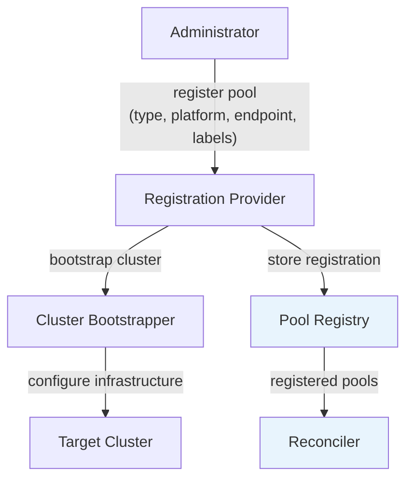

### Registration Provider

Accepts a pool registration request from an administrator and orchestrates the registration lifecycle: validate the request, bootstrap the target infrastructure, and store the registration in the Pool Registry.

**Responsibilities:**
- Validate the registration request (endpoint reachability, credentials, platform compatibility)
- Delegate infrastructure bootstrapping to the Cluster Bootstrapper
- Store the completed registration in the Pool Registry
- Support updating an existing registration (e.g. changing labels, resizing capacity)
- Support deregistering a pool (drain workers, tear down bootstrapped resources, remove from registry)

**Registration request includes:**
- Pool name and description
- Cluster endpoint (API server URL, kubeconfig, or connection details)
- Platform type (OpenShift, RHEL)
- Worker type and provisioner backend (see below)
- Labels (key/value pairs for affinity matching)
- Connectivity metadata (reachable network endpoints)
- Capacity limits (max concurrent workers, resource quotas)
- Credentials for cluster access (service account token, certificate, SSH key)

### Worker Type

Each pool is registered with a worker type that determines how workers are provisioned and whether they persist between tasks.

| Worker Type | Lifecycle | Provisioner Model | Description |
|---|---|---|---|
| **Short-lived** | Ephemeral — created per task, destroyed after | Create/destroy | A new worker is provisioned for each task and torn down on completion. No state carries between tasks. |
| **Long-lived** | Persistent — claimed per task, released after | Claim/release (shared pool) | A pool of pre-provisioned workers is maintained. Workers are claimed for a task and returned to the pool on completion. |

Worker type is orthogonal to provisioner backend — for example, a vanilla K8s pool can operate in either mode (Deployment with Lease claiming for long-lived, or pod-per-task for short-lived).

### Provisioner Backend

Each pool is registered with a provisioner backend that determines the runtime technology used to create and manage workers.

| Backend | Short-lived | Long-lived | Description |
|---|---|---|---|
| **Vanilla Kubernetes** | Yes | Yes (MVP) | Standard Kubernetes pods. Long-lived mode uses a Deployment with Lease-based claiming. |
| **OpenShell** | Yes | No | NVIDIA policy-based sandboxing. Sandbox created per task, destroyed after. |
| **Agent Sandbox** | Yes | Yes | K8s-native CRD-managed pools. Warm pool mode pre-provisions pods. |
| **Substrate** | Yes | No | Custom substrate runtime. Sandbox created per task. |

### Platform

Each pool is registered against a target platform that determines the infrastructure capabilities and bootstrapping steps.

| Platform | MVP | Description |
|---|---|---|
| **OpenShift** | Yes | On-cluster or remote OpenShift cluster. Supports namespaces, SCCs, Routes, NetworkPolicies. |
| **RHEL** | No (future) | Standalone RHEL host. Supports Podman-based container execution. Delivered via [ANSTRAT-2338](https://redhat.atlassian.net/browse/ANSTRAT-2338). |

### Cluster Bootstrapper

Configures the target infrastructure to support worker provisioning. What the bootstrapper does depends on the platform and provisioner backend combination. The bootstrapper is an abstraction — each combination has its own implementation.

**Responsibilities:**
- Create or validate the target namespace on the cluster
- Deploy RBAC resources (ServiceAccount, Role, RoleBinding) for the scheduler/provisioner
- Install and configure the provisioner backend runtime (if required)
- Deploy worker Deployment/ReplicaSet (for long-lived vanilla K8s pools)
- Configure network policies and security context constraints
- Validate that the cluster is ready to accept workers
- Report bootstrap status (success, partial, failed)

**Bootstrapping by backend:**

| Backend | Platform | Bootstrap Actions |
|---|---|---|
| Vanilla K8s (long-lived) | OpenShift | Create namespace, deploy RBAC, deploy worker Deployment, configure readiness/liveness probes |
| Vanilla K8s (short-lived) | OpenShift | Create namespace, deploy RBAC, configure pod security context |
| OpenShell | OpenShift | Create namespace, deploy RBAC, install OpenShell operator (Helm), configure SCCs, deploy compute driver |
| Agent Sandbox | OpenShift | Create namespace, deploy RBAC, install Agent Sandbox operator, create SandboxWarmPool CRD |
| Vanilla K8s | RHEL | Configure Podman runtime, deploy agent binary, establish connectivity to control plane |

### Pool Registry

Stores all registered Worker Pool configurations and makes them available to the Reconciler at runtime.

**Responsibilities:**
- Persist pool registrations (database-backed)
- Provide the Reconciler with the current set of registered and healthy pools
- Track registration status (registering, bootstrapping, active, degraded, deregistering)
- Store the pool's provisioner backend type so the Task Executor can select the correct `ProvisionerBackend` implementation at runtime

### Registration Lifecycle

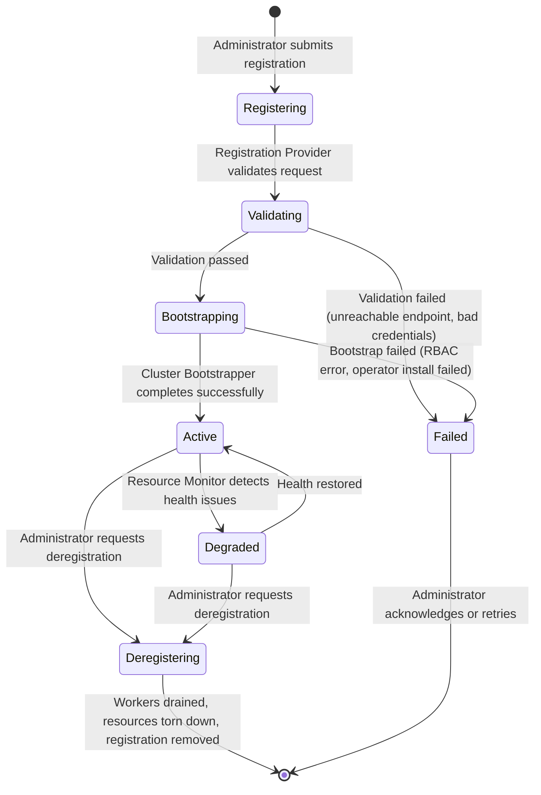

### Registration Sequence

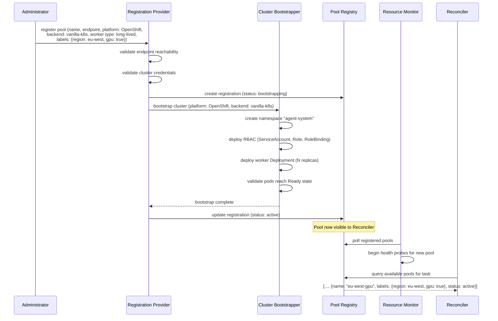

### Deregistration

Removing a pool is a controlled process: drain active workers, tear down bootstrapped resources, and remove the registration.

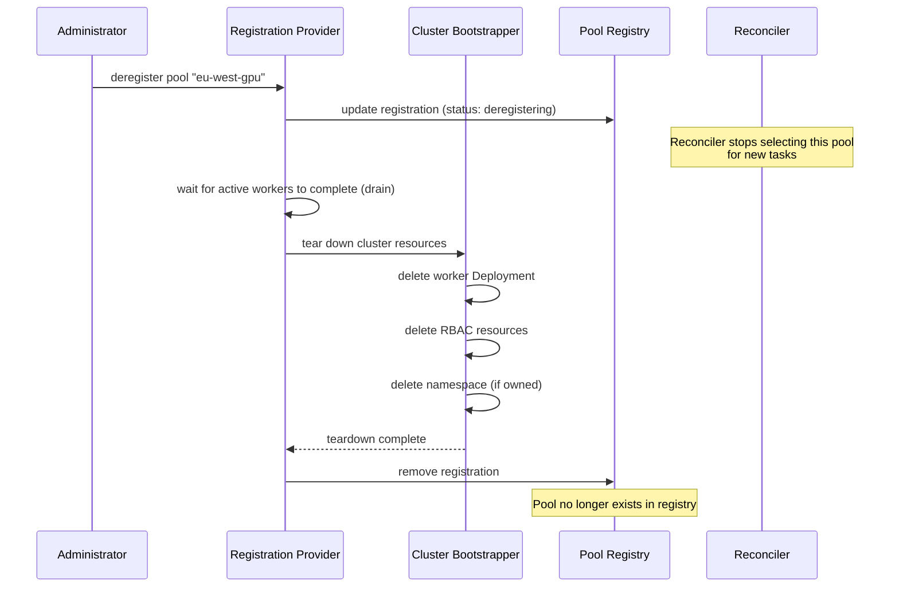

## Sequence Diagrams

### Task Execution: Happy Path

The complete flow from a workflow task node becoming ready to execute, through worker selection, provisioning, and dispatch, to result delivery. The Workflow Engine calls `execute_task` on the Task Executor and receives a result — it has no visibility into the internal pipeline.

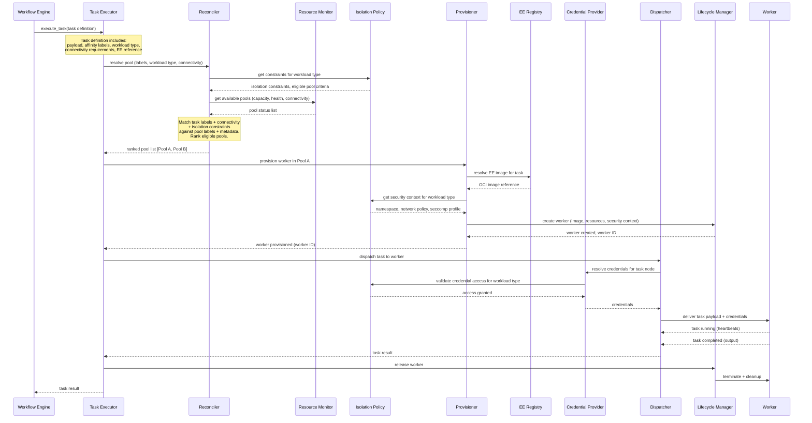

### Task Execution: Critical Path (Simplified)

The essential sequence through the critical path components, omitting supporting concerns (Isolation Policy, EE Registry, Resource Monitor, Lifecycle Manager).

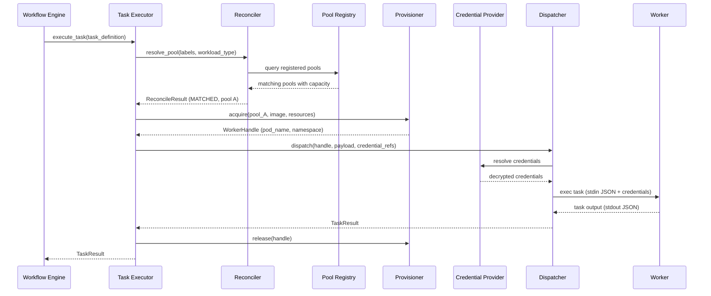

### Reconciliation: Pool Selection Logic

Detail of how the Reconciler evaluates candidate pools. The Task Executor calls the Reconciler; the Workflow Engine is not involved.

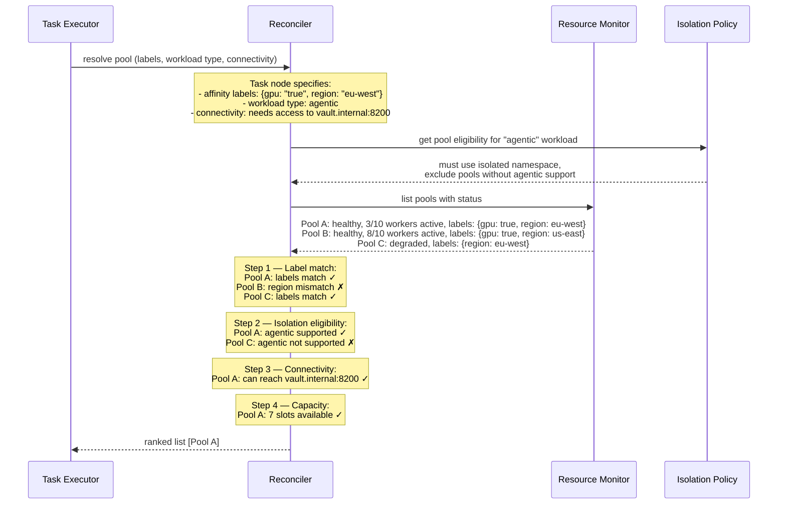

### Provisioning Failure and Fallback

What happens when provisioning fails in the selected pool. The Task Executor handles the retry logic internally — the Workflow Engine is unaware of the fallback.

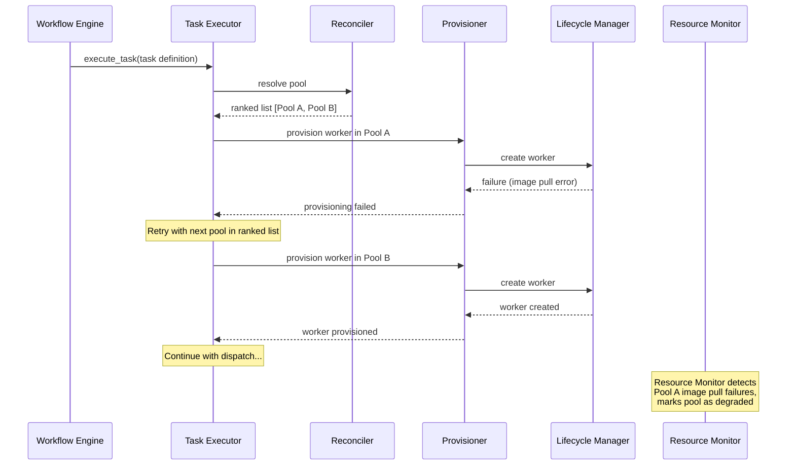

### Worker Lifecycle

The lifecycle of a Worker from creation through cleanup.

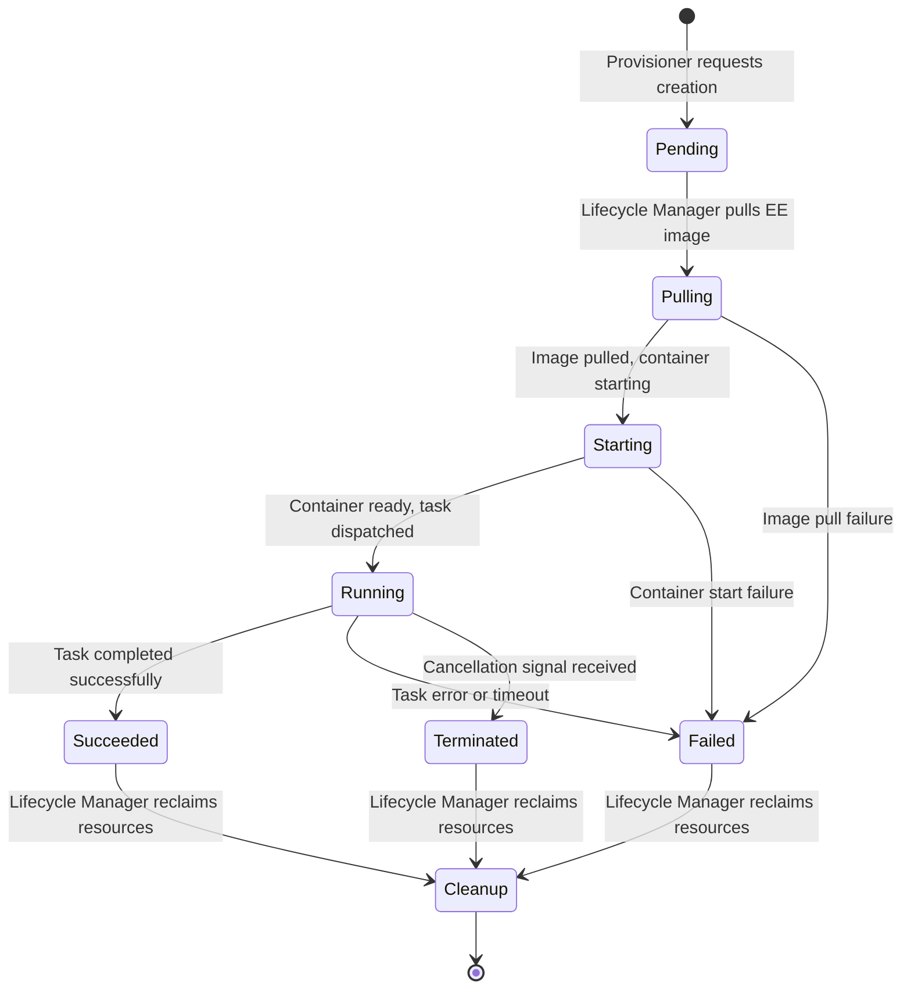

### Credential Injection with Isolation

How credentials are scoped by workload type.

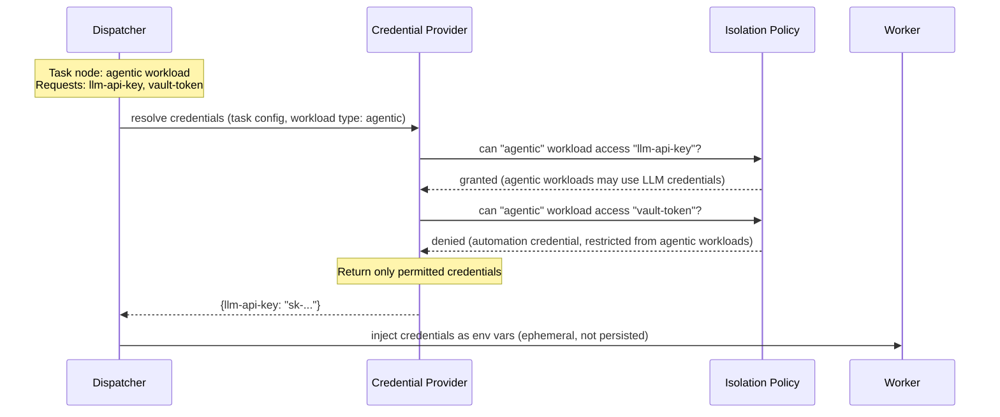

### Back-Pressure: Capacity Exhaustion and Scale-Up

Shows the flow when all matching Worker Pools are at capacity. The Reconciler detects the condition, the Task Executor decides what to do, and the Provisioner attempts to add capacity.

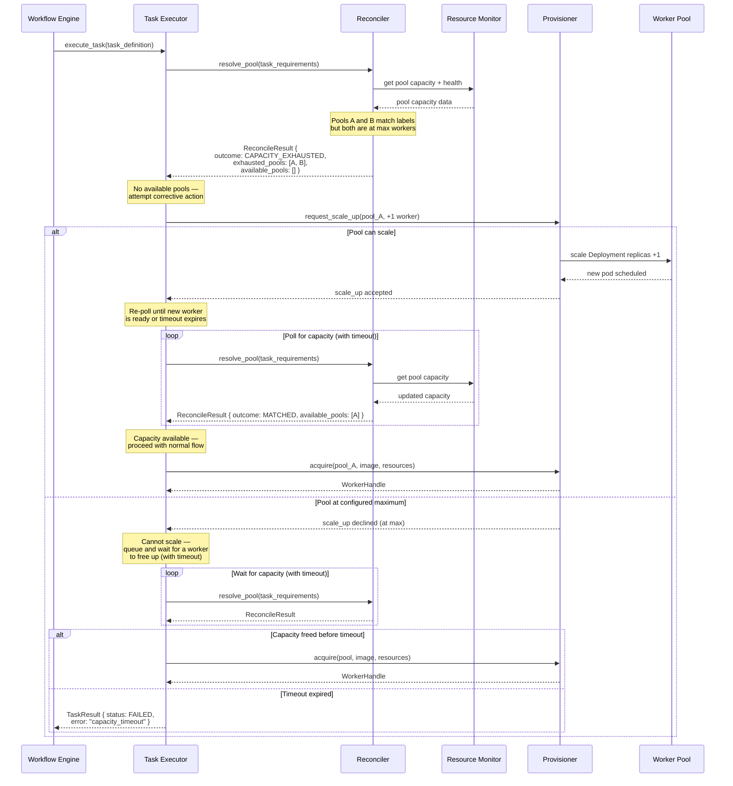

**Design decisions:**

- **Reconciler detects, Task Executor decides.** The Reconciler is a pure query — it never mutates state. The Task Executor holds the policy for what to do when capacity is exhausted (queue, scale, fail).
- **Scale-up via the Provisioner.** The Provisioner already knows the pool's infrastructure (K8s Deployment, Agent Sandbox CRD, etc.), so it is the natural component to request additional capacity from. No separate Autoscaler component is needed for the MVP.
- **Bounded retries with timeout.** The Task Executor re-polls the Reconciler rather than blocking on a notification. This keeps the design simple and avoids event-bus coupling. The overall task timeout (from the task definition) bounds how long the Task Executor will wait.
- **No dedicated Task Queue component for MVP.** The Task Executor holds the waiting task in-process. A persistent, shared task queue can be introduced later if cross-instance coordination or priority scheduling is needed.

## Entity Relationships


## MVP Scope (On-Cluster OpenShift)

Per the July 2026 planning decisions ([ANSTRAT-1803](https://redhat.atlassian.net/browse/ANSTRAT-1803) comments):

| Component | MVP Scope |
|---|---|
| Task Executor | Single `execute_task` entry point for the Workflow Engine; orchestrates the full pipeline including back-pressure handling (in-process queue, scale-up requests, bounded timeout) |
| Worker | OpenShift pod within the control plane cluster |
| Worker Pool | Single on-cluster pool (same namespace or dedicated namespace) |
| Reconciler | Global affinity only; project/workflow/node-level affinity deferred. Returns structured `ReconcileResult` with outcome (`MATCHED` / `CAPACITY_EXHAUSTED` / `NO_MATCHING_POOLS`) |
| Provisioner | OpenShift pod provisioner (Kubernetes API). Implementation-agnostic interface. Supports `acquire`/`release` and `request_scale_up` (bounded by pool max) |
| Dispatcher | Deliver task payload, collect results |
| EE Registry | OCI image references from customer-accessible registries |
| Resource Monitor | Pod/agent list view for administrators |
| Credential Provider | Credential injection scoped by workload type |
| Isolation Policy | Container isolation + namespace separation (no OpenShell/policy-based sandboxing) |
| Lifecycle Manager | Pod lifecycle management (create, monitor, cleanup) |

### Future Phases

- **[ANSTRAT-2337](https://redhat.atlassian.net/browse/ANSTRAT-2337):** External OpenShift cluster execution (polling and push connectivity to remote OCP clusters)
- **[ANSTRAT-2338](https://redhat.atlassian.net/browse/ANSTRAT-2338):** External RHEL execution (hop nodes and execution nodes on RHEL)
- Per-project, per-workflow, and per-node affinity rules
- Policy-based sandboxing (OpenShell integration)
- EE build tooling (extending ansible-builder or new tool)
