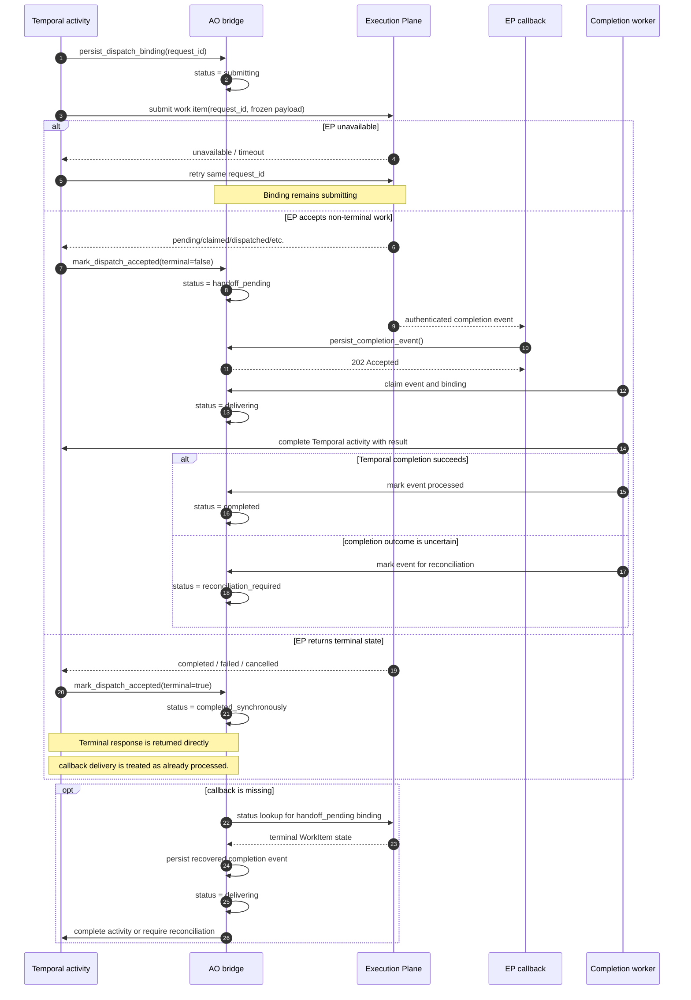
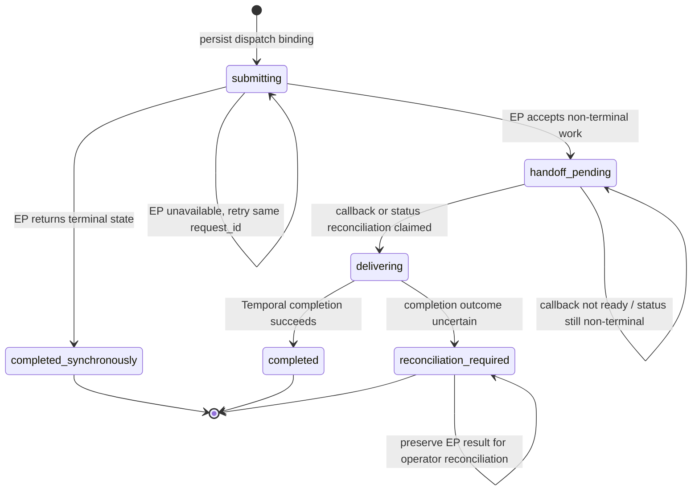

# ExecutionPlaneActivityBinding status

`ExecutionPlaneActivityBinding.status` is AO's durable state machine for
connecting one Temporal activity attempt to one idempotent Execution Plane
request. The binding records dispatch handoff and completion delivery; it does
not mirror the EP WorkItem state.

## Sequence

## State machine

`reconciliation_required` is intentionally terminal from the worker's point
of view: AO must not risk completing the Temporal activity twice when the
previous completion outcome is unknown.
