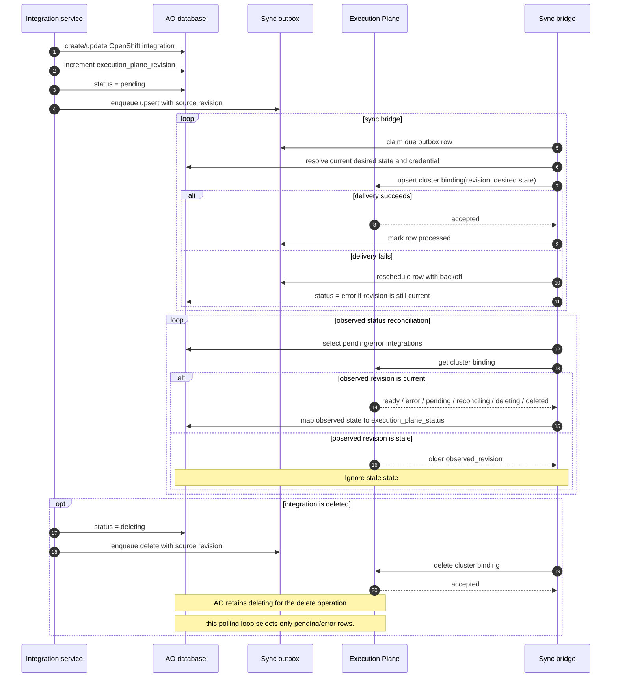
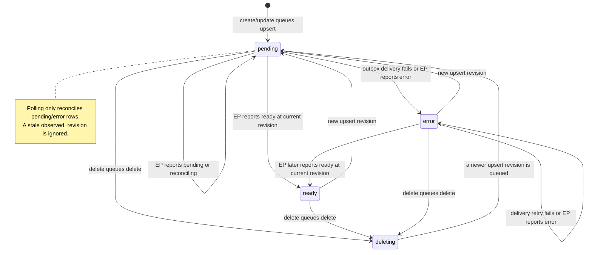

# Integration.execution_plane_status

`Integration.execution_plane_status` is AO's user-visible state machine for
the observed Execution Plane representation of an OpenShift integration. AO
owns the desired configuration and revision; EP owns the observed resource
state. The status is updated by the integration service when it queues a
revision, by the sync outbox when delivery fails, and by polling EP's status
resource.

## Sequence

## State machine

`deleted` is deliberately mapped to `deleting`; the AO enum represents the
delete operation in progress rather than adding a separate terminal value.
