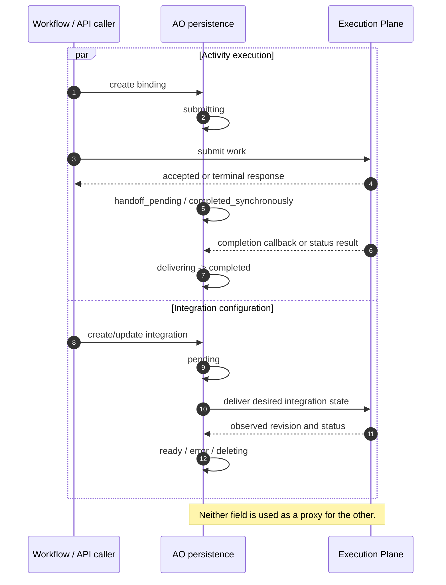

# Execution Plane status progression overview

The activity binding and integration status fields are separate state machines
with different owners and lifecycles:

| Field | Scope | Initial transition | Terminal or steady states |
| --- | --- | --- | --- |
| `ExecutionPlaneActivityBinding.status` | One Temporal activity request | `submitting` during durable dispatch preparation | `completed_synchronously`, `completed`, or `reconciliation_required` |
| `Integration.execution_plane_status` | One OpenShift integration revision | `pending` for upsert, `deleting` for delete | `ready`, `error`, or continued `deleting` |

## Independent progression

The activity binding answers “what is the delivery outcome for this Temporal
activity request?” The integration status answers “what state has EP observed
for this integration revision?”
